# 알고리즘 _List

## 배열1(Array 1)

### 알고리즘
- 알고리즘 : 유한한 단계를 통해 문제를 해결하기 위한 절차나 방법
- 컴퓨터가 어떤 일을 수행하기 위한 단계적 방법
- 어떠한 문제를 해결하기 위한 절차

#### 좋은 알고리즘
1. 정확성 : 얼마나 정확하게 동작하는가
2. 작업량 : 얼마나 적은 연산으로 원하는 결과를 얻어내는가
3. 메모리 사용량 : 얼마나 적은 메모리를 사용하는가
4. 단순성 : 얼마나 단순한가
5. 최적성 : 더 이상 개선할 여지없이 최적화되었는가

- 어떤 알고리즘을 사용해야 하는가? -> 알고리즘의 성능 분석 필요 
  - 많은 문제에서 성능 분석의 기준으로 알고리즘의 작업량을 비교한다.
- 알고리즘의 작업량을 표현할 때 시간복잡도로 표현한다.
  - 시간 복잡도(Time Complexity)
  - 실제 걸리는 시간을 측정
  - 실행되는 명령문의 개수로 계산
#### 빅-오(O) 표기법 : 시간 복잡도
- 시간 복잡도 함수 중에서 가장 큰 영향력을 주는 n에 대한 항만을 표기
- 계수는 생략하여 표기
  - ex) n개의 데이터를 입력 받아 저장한 후 각 데이터에 1씩 증가시킨 후 각 데이터를 화면에 출력하는 알고리즘의 시간 복잡도는 어떻게 되나?
    - O(n) 
### 배열(Array)
- 일정한 자료형의 변수들을 하나의 이름으로 열거하여 사용하는 자료구조

#### 배열의 필요성
- 프로그램 내에서 여러개의 변수가 필요할 때, 일일이 다른 변수명을 이용하여 자료에 접근하는 것은 매우 비효율적
- 배열을 사용하면 하나의 선언을 통해서 둘 이상의 변수를 선언
- 다수의 변수로는 하기 힘든 작업을 배열을 활용해 쉽게 할 수 있다

#### 1차원 배열
- 별도의 선언 방법이 없으면 변수에 처음 값을 할당할 때 생성
- ex) Arr = list / [] 등
- 인덱스를 활용해서 접근

##### 배열활용 예제
- Gravity

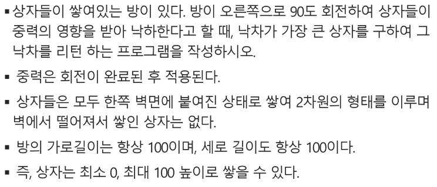
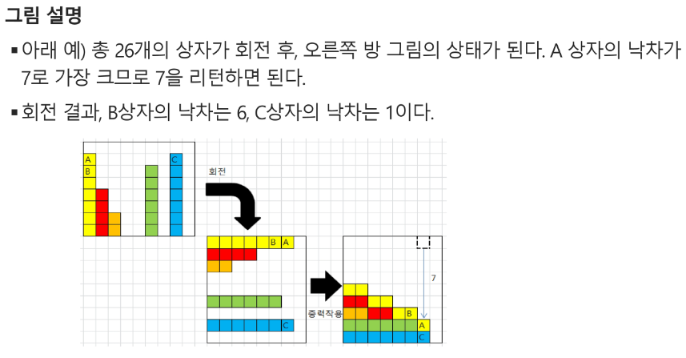

- !해설
  각 자리별로 숫자화 74200670 ... 
~~~python
box = list(map(int,input().split())) # box = [7,4,2,0,0,6,7,0 ...]
# 각 항목의 오른쪽에 더 작은애가 몇개가 있니?
for i in range(0,n-1) # 박스의 원소에 대해
    count = 0 # box[i]보다 작은 숫자 카운트 하겠음
    for j in range(i+1,n-1)
        if box[i]>box[j]
        count += 1
    ans[i] = count
    

ans = [7,5,4,0,...]
#배열 중 가장 최대 값 찾기
MaxV = ans[0]
for i in range(0,n-1)
    if MaxV < ans[i]
    MaxV == ans[i]
# 그럼 그 최대값 어디 들었니? 

~~~

### 정렬
- 2개 이상의 자료를 특정 기준에 의해 작은 값부터 큰 값(오름차순:ascending), 혹은 그 반대의 순서대로(내림차순:descending) 재배열하는 것
- 키 : 자료를 정렬하는 기준이 되는 특정 값

#### 대표적인 정렬 방식의 종류
- 버블 정렬(Bubble Sort)
- 카운팅 정렬(Counting Sort)
- 선택 정렬(Selection Sort)
- 퀵 정렬(Quick Sort)
- 삽입 정렬(Insertion Sort)
- 병합 정렬(Merge Soft)

### 버블 정렬(Bubble Sort)
- 인접한 두 개의 원소를 비교하며 자리를 계속 교환하는 방식
- 정렬 과정
  - 첫번째 원소부터 인접한 원소끼리 계속 자리를 교한하면서 맨 마지막 자리까지 이동한다.
  - 한 단계가 끝나면 가장 큰 원소가 마지막 자리로 정렬된다.
  - 교환하며 자리를 이동하는 모습이 물 위에 올라오는 거품과 같다고 하여 버블 정렬이라 한다
- 시간 복잡도
  - O(n^2)

#### [55,7,78,12,42]를 정렬하는 과정(오름차순)

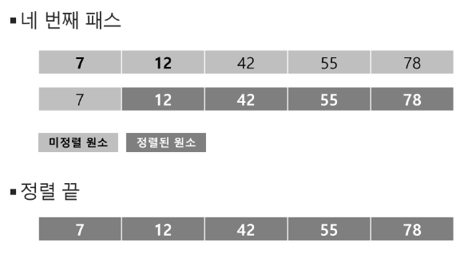

1. 처음에 정해진 구간이 어디까지인지? -> i : N-1 -> 1 # 구간의 끝
2. j : 0 -> i-1 까지 # 비교하는 왼쪽 인덱스
3. j 랑 j+1 비교해서 j 가 더 크면 자리를 바꿔라
 
#### 배열을 활용한 버블 정렬
- 앞서 살펴 본 정렬 과정을 코드로 구현하면 아래와 같다.(오름차순)

~~~python
def BubbleSort(a,N)
    for i in range(N-1,0,-1)
    a부터 b까지 c만큼씩
    0,N-1,1
    rang(a,b,c) :
        for j in range(i) :
            if a[j] > a[j+1]:
                a[j], a[j+1] = a[j+1], a[j]
~~~

#### 최대 값 찾기 연습
~~~python
'''
5
55 6 68 12 42
6 
55 7 78 12 42 100
7
55 7 78 12 42 2 90
가장 큰 값을 출력
#1 78
#2 100
# # 90 
'''
T = int(input())
for tc in range(1,T+1):
    N = int(input())
    arr = list(map(int,input().split()))
    maxV = arr[0] # 첫 원소를 최대로 가정
    for i in range(1,N) : # 나머지 원소와 비교
        if maxV < arr[i]:
            maxV = arr[i]
    print(f'#{tc} {maxV}')
~~~

### 카운팅 정렬(counting Sort)
- 항목들의 순서를 결정하기 위해 집합에 각 항목이 몇 개씩 있는지 세는 작업을 하여, 선형 시간에 정렬하는 효율적인 알고리즘
- 제한사항
  - 정수나 정수로 표현할 수 있는(고유번호를 지정할 수 있다면) 자료에 대해서만 적용 가능 : 각 항목의 발생 회수를 기록하기 위해, 정수 항목으로 인덱스 되는 카운트들의 배열을 사용하기 때문이다.
  - 카운트들을 위한 충분한 공간을 할당하려면 집합 내의 가장 큰 정수를 알아야 한다.
- 시간 복잡도
  - O(n+k): n은 리스트 길이, k는 정수의 최대값
 
 - 정렬하는 과정([0,4,1,3,1,2,4,1])
 - Data에서 각 항목들의 발생 회수를 세고, 정수 항목들로 직접 인덱스 되는 카운트 배열 counts에 저장한다.
 - 정렬된 집합에서 각 항목의 앞에 위치할 항목의 개수를 반영하기 위해 counts의 원소를 조정한다

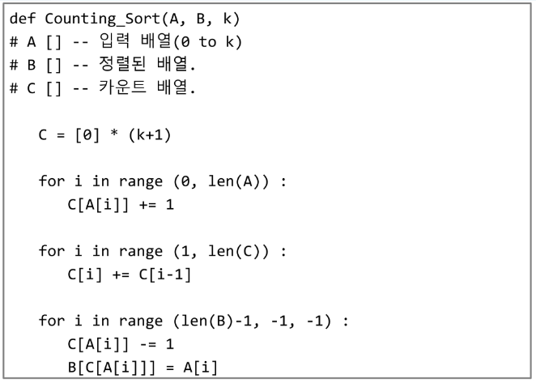

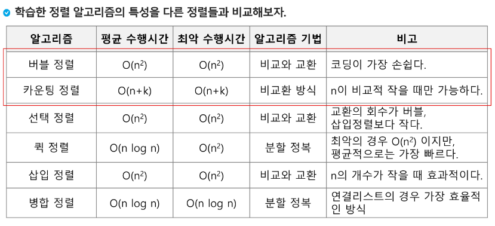

### Baby-gin Game
- 0~9 사이의 숫자 카드에서 임의의 카드 6장을 뽑았을 때, 3장의 카드가 연속적인 번호를 갖는 경우를 run이라 하고, 3장의 카드가 동일한 번호를 갖는 경우는 triplet이라고 한다.
- 그리고, 6장의 카드가 run과 triplet로만 구성된 경우를 baby-gin으로 부른다
- 6자리의 숫자를 입력 받아 baby-gin 여부를 판단하는 프로그램을 작성하라

- 입력 예
  - 667767은 두개의 triplet이므로 baby-gin이다(666,777)
  - 054060 은 한개의 run과 한개의 triplet이므로 역시 baby-gin이다(456,000)
  - 101123은 한개의 triplet이 존재하나 나머지가 아니므로 baby-gin이 아니다.

### 완전검색(Exaustive Search)
- 완전 검색 방법은 문제의 해법으로 생각할 수 있는 모든 경우의 수를 나열해보고 확인하는 기법이다.
- Brute-force 혹은 generate-and-test 기법이라고도 불리 운다.
- 모든 경우의 수를 테스트 한 후, 최종 해법을 도출한다.
- 일반적으로 경우의 수가 상대적으로 작을 때 유용하다.
- 모든 경우의 수를 생성하고 테스트하기 때문에 수행 속도는 느리지만, 해답을 찾아내지 못할 확률이 작다.
- 주어진 문제를 풀 때, 우선 완전 검색으로 접근하여 해답을 도출하고, 성능 개선을 위해 다른 알고리즘을 사용하고 확인해보자

#### 완전 검색을 활용한 Baby-gin 접근
- 고려할 수 있는 모든 경우의 수 생성
  - 6개의 숫자로 만들 수 있는 모든 숫자 나열(중복 포함)
  - ex) [2,3,5,7,7,7] 을 받으면, 255666,237577... 으로
- 해답 테스트 하기 
  - 앞의 3자리와 뒤의 3자리를 잘라, run, triplet 여부를 테스트하고 최종적으로 판단
- ex) 2 3 5 7 7 7 -> triplet 하나만 있음, baby-gin 아님!

#### 순열(Permutation)
- 서로 다른 것들 중 몇개를 뽑아서 한 줄로 나열하는 것
- 서로 다른 n개 중 r개를 택하는 순열 **nPr**
- nPr = n*n-1*n-2*n-3 ... (n-r+1) = n!/(n-r)!
- nPn = n!(팩토리얼)

### 탐욕(Greedy) 알고리즘
- 탐욕 알고리즘은 최적해를 구하는 데 사용되는 근시안적인 방법
- 여러 경우 중 하나를 결정해야 할 때마다 그 순간에 최적이라고 생각되는 것을 선택해 나가는 방식으로 진행하여 최종적인 해답에 도달한다.
- 각 선택의 시점에서 이루어지는 결정은 지역적으로는 최적이지만, 그 선택들을 계속 수집하여 최종적인 해답을 만들었다고 하여, 그것이 최적이라는 보장은 없다.
- 일반적으로, 머릿속에 떠오르는 생각을 검증 없이 구현하면 Greedy 접근이 된다.

#### 동작 과정
1. 해 선택 : 현재 상태에서 부분 문제의 최적 해를 구한 뒤, 이를 부분해집합(Solution Set)에 추가한다.
2. 실행 가능성 검사 : 새로운 부분해 집합이 실행 가능한지를 확인한다. 곧 문제의 제약 조건을 위반하지 않는지를 검사한다.
3. 해 검사 : 새로운 부분해 집합이 문제의 해가 되는지를 확인한다. 아직 전체 문제의 해가 와넛ㅇ되지 않는다면 1번 해 선택 부터 다시한다.

#### 그리디 예
- 거스름돈 줄이기

1. 해 선택 : 가장 좋은 해 선택, 단위가 큰 동전을 골라서 주면 개수가 줄어든다. 현재 고를 수 있는 가장 단위가 큰 동전을 하나 골라 추가한다.
2. 실행 가능성 검사 : 거스롬돈이 액수를 초과하는지 확인한다. 초과한다면 빼고 다시 동전을 선택
3. 해 검사 : 거스름돈과 액수가 일치하는지 확인

- Baby-gin 을 다른 방법으로 풀기
  1. 카운트 배열에 각 원소를 체크해서 넣음
  2. triplet 먼저 카운트에서 제거
  3. run해당한 카운트 제거
~~~python
num = 456789 # Baby gin을 확인할 6자리 수
c = [0]*12 # 각 자리수를 추출하여 개수를 누적할 리스트(왜 12개지? 트리플렛이랑 런 둘다 같은 변수 쓰려고)

for i in range(6):
  c[num % 10 ] += 1
  num // = 10

i = 0
tri = run = 0
while i < 10 :
  if c[i] >= 3 : #triplet 조사 후에 데이터 삭제
    c[i] -= 3 
    tri += 1
    continue
  if c[i] >= 1 and c[i+1] >= 1 and c[i+2] >=1 : # run 조사 후 데이터 삭제
    c[i] -= 1
    c[i+1] -= 1
    c[i+2] -= 1
    rin += 1
    continue
  i += 1

if run + tri == 2 :
  print('Baby Gin!')
else :
  print('Lose T-T')
~~~
  
## 배열2(Array 2)

### 2차원 배열
#### 2차원 배열의 선언
- 1차원 List를 묶어놓은 list
- 2차원 이상의 다차원 List 는 차원에 따라 index를 선언
- 2차원 list의 선언 : 세로길이(행의 개수), 가로길이(열의개수)를 필요로 함
- Python에서는 데이터 초기화를 통해 변수선언과 초기화가 가능함

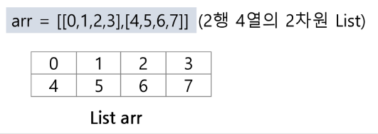

~~~python
N = int(input)
arr = [list(map(int,input().split()))for _ in range(N)]
'''
3
1 2 3
4 5 6
7 8 9
'''
~~~
- 배열 순회
- n X m 배열의 n*m 개의 모든 원소를 빠짐없이 조사하는 방법 (접근하는 방법)

#### 행 우선 순회
~~~python
# i 행의 좌표
# j 열의 좌표
for i in range(n):
  for j in range(m):
    Array[i][j] # 필요한 연산 수행
~~~

#### 열 우선 순회
~~~python
# i 행의 좌표
# j 열의 좌표
for j in range(m):
  for i in range(n):
    Array[i][j] # 필요한 연산 수행
~~~

#### 지그재그 순회
~~~python
# i 행의 좌표
# j 열의 좌표
for i in range(n):
  for j in range(m):
    Array[i][j + (m-1-2*j)*(i%2)]
    # 필요한 연산 수행
~~~

#### 델타를 이용한 2차 배열 탐색
- 2차 배열의 한 좌표에서 4방향의 인접 배열 요소를 탐색하는 방법

~~~python 
di[] <- [0,0,-1,1] # 상하좌우
dj[] <- [-1,1,0,0]
for i : 0 -> N-1
  for j : 0 -> N-1 :
    for k in range(4):
      ni <- i + di[k]
      nj <- j + dj[k]
      if 0 <= ni < N and 0 <= nj < N
      # 유효한 인덱스면
        test(arr[ni][nj])
~~~
~~~python
dx = [0,0,1,-1]
dy = [1,-1,0,0]

cx = 1 # 현재 x 좌표
cy = 1 # 현재 y 좌표
for i in range(4):
  nx = cx + dx[i] # 새로운 x 좌표
  ny = cy + dy[i] # 새로운 y 좌표
  print(nx,ny)

예시
~~~python
di = [0,1,0,-1] # 우하좌상
dj = [1,0,-1,1]
N = 3
for i in range(N):
  for j in range(N):
    for k in range(4):
      ni, nj = i+di[k], j+dj[k]
      if 0 <= ni < N and 0 <= nj < N
      print(i,j,ni,nj)
~~~
~~~python
N=3
for i in range(N):
  for j in range(N):
    for di, dj in [[0,1],[1,0],[0,-1],[-1,0]]
    if 0<= ni < N and 0 < nj < N :
      print(i,j,ni,nj)
~~~

- 전치 행렬
~~~python
# i : 행의 좌표, len(arr)
# j : 열의 좌표, len(arr[0])
arr = [[1,2,3,],[4,5,6],[7,8,9]] # 3*3 행렬

for i in range(3):
  for j in range(3):
    if i < j :
      arr[i][j], arr[j][i] = arr[j][i],arr[i][j]
~~~

### 부분집합 합(subset Sum)문제
- 유한 개의 정수로 이루어진 집합이 있을 때, 이 집합의 부분집합 중에서 그 집합의 원소를 모두 더한 값이 0이 되는 경우가 있는지를 알아내는 문제
- 예를 들어, [-7,-3,-2,5,8]이라는 집합이 있을때 [-3,-2,5]는 이 집합의 부분집합이면서 (-3)+(-2)+(5) = 0 이므로 이 경우의 답은 참이 된다.
- 완전 검색 기법으로 부분 집합 합 문제를 풀기 위해서는, 우선 집합의 모든 부분집합을 생성 한 후에 각 부분집합의 합을 계산해야 한다.
- 주어진 집합의 부분집합을 생성하는 방법에 대해서 생각해보자
- 부분집합의 수
  - 집합의 원소 n개일 때, 공집합을 포함한 부분집합의 수는 2^n개이다.
  - 이는 각 원소를 부분집합에 포함시키거나 시키지않는 경우 2가지 경우를 모든 원소에 적용한 경우의 수와 같다.
  - ex {1,2,3,4} => 2x2x2x2 = 16개(2^4)

- 각 원소가 부분집합에 포함되어있는지를 loop 이용하여 확인하고 부분집합을 생성하는 방법

~~~python
bit = [0,0,0,0]
for i in range(2):
  bit[0] = i # 0번째 원소
  for j in range(2):
    bit[1] = j # 1번째 원소
    for k in range(2): 
      bit[2] = k # 2번째 원소
      for l in range(2):
        bit[3] = l # 3번째 원소
        print_subset(bit)
~~~

- 비트 연산자
  - & 비트 단위로 AND 연산을 한다
  - | 비트 단위로 OR 연산을 한다
  - << 피연산자의 비트 열을 왼쪽으로 이동시킨다.
  - `>> 피연산자의 비트 열을 오른쪽으로 이동시킨다.
- << 연산자
  - 1 << n : 2^n 즉, 원소가 n개일 경우의 모든 부분집합의 수를 의미한다.
  - ㅑ & (1<<j) : i의 j 번째 비트가 1인지 아닌지를 검사한다.
#### 비트연산자 쓰는 이유
- 속도가 굉장히 빠르다
- 
### 보다 간결하게 부분집합을 생성하는 방법
~~~python
arr = [3,6,7,1,5,4]

n = len(arr)

for i in range(1<<n) :
  for j in range(n):
    if i & (1<<j):
      print(arr[j], end=", ")
  print()
print()
~~~

### 검색(Search)
- 저장되어 있는 자료 중에서 원하는 항목을 찾는 작업
- 목적하는 탐색 키를 가진 항목을 찾는 것
  - 탐색 키 : 자료를 구별하여 인식할 수 있는 키
- 검색의 종류
  - 순차 검색(sequential search)
  - 이진 검색(binary search)
  - 해쉬(hash)

### 순차 검색(Sequential Search)
- 일렬로 되어 있는 자료를 순서대로 검색하는 방법
  - 가장 간단하고 직관적인 검색 방법
  - 배열이나 연결 리스트 등 순차구조를 구현된 자료구조에서 원하는 항목에 찾을 때 유용함
  - 알고리즘이 단순하여 구현이 쉽지만, 검색 대상의 수가 많은 경우에는 수행시간이 급격히 증가하여 비효율적임
- 2가지 경우
  - 정렬되어 있지 않은 경우
  - 정렬되어 있는 경우

#### 정렬되어 있지 않은 경우
- 검색 과정
  - 첫 번째 원소부터 순서대로 검색 대상과 키 값이 같은 원소가 있는지 비교하며 찾는다.
  - 키 값이 동일한 원소를 찾으면 그 원소의 인덱스를 반환한다.
  - 자료구조의 마지막에 이를 때까지 검색 대상을 찾지 못하면 검색 실패
  
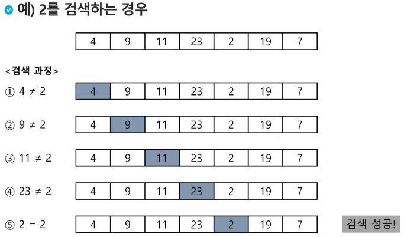

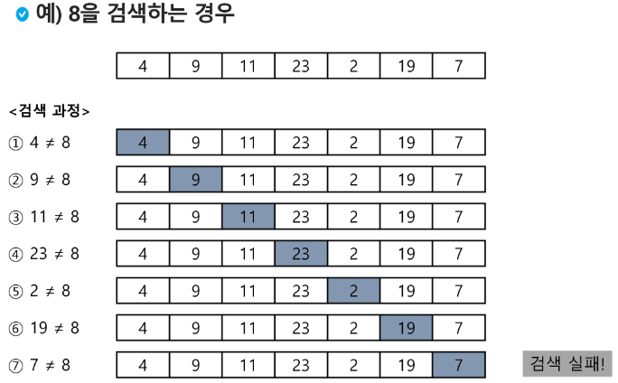

- 찾고자 하는 원소의 순서에 따라 비교회수가 결정됨
  - 첫 번째 원소를 찾을 떄는 1번 비교, 두 번째 원소를 찾을 떄는 2번 비교... 
  - 정렬되지 않은 자료에서의 순차 검색의 평균 비교 회수 = (1/n)*(1+2+3...+n) = (n+1)/2
  - 시간 복잡도 : O(n)
~~~python
def sequentialSearch(a,n,key):
  # a = 검색할 대상
  # n = 검색 수 
  # key = 키 값
  i = 0
  while i < n and a[i] != key:
    # i < n : 검색 횟수보다 적게해서 범위오류를 막는다 / 반드시 유효검사가 먼저 와야 된다(and연산, 순차적)
    i = i+1
    if i < n: 
      return i
    else:
      return -1
~~~

#### 정렬되어 있는 경우
- 검색 과정
  - 자료가 오름차순으로 정렬된 상태에서 검색을 실시한다고 가정할 때,
  - 자료를 순차적으로 검색하면서 키 값을 비교하여, 원소의 키 값이 검색 대상의 키 값보다 크면 찾는 원소가 없다는 것이므로 더 이상 검색하지 않고 검색을 종료
  
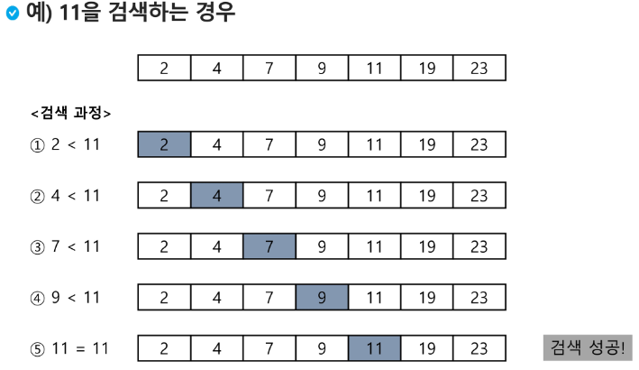

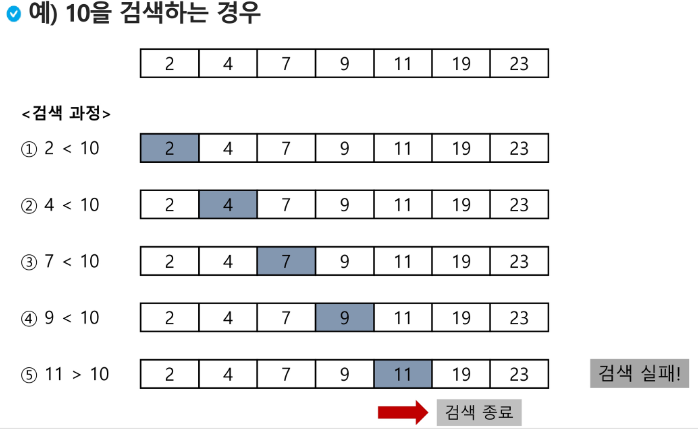

- 찾고자 하는 원소의 순서에 따라 비교회수가 결정됨
  - 정렬이 되어있으므로, 검색 실패를 반환하는 경우 평균 비교 회수가 반으로 줄어든다.
  - 시간 복잡도 : O(n)
~~~python
def sequentialSearch2(a,n,key):
  i = 0
  while i < n and a[i] < key :
    i = i+1
    if i < n and a[i] == key :
      return i
    else : 
      return -1
~~~

### 이진 검색(Binary Search)
- 자료의 가운데에 있는 항목의 키 값과 비교하여 다음 검색의 위치를 결정하고 검색을 계속 진행하는 방법
  - 목적 키를 찾을 때까지 이진 검색을 순환적으로 반복 수행함으로써 검색 범위를 반으로 줄여가면서 보다 빠르게 검색을 수행함.
- **이진 검색을 하기 위해서는 자료가 정렬된 상태여야 한다.**
  
- 검색 과정
  - 자료의 중앙에 있는 원소를 고른다
  - 중앙 원소의 값과 찾고자 하는 목표 값을 비교한다.
  - 목표 값이 중앙 원소의 값보다 작으면 자료의 왼쪽 반에 대해서 새로 검색을 수행하고, 크다면 자료의 오른쪽 반에 대해서 새로 검색을 수행한다.
  - 찾고자 하는 값을 찾을때까지 1-3의 과정을 반복한다.

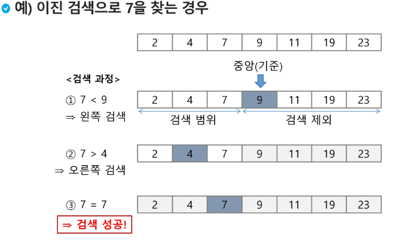

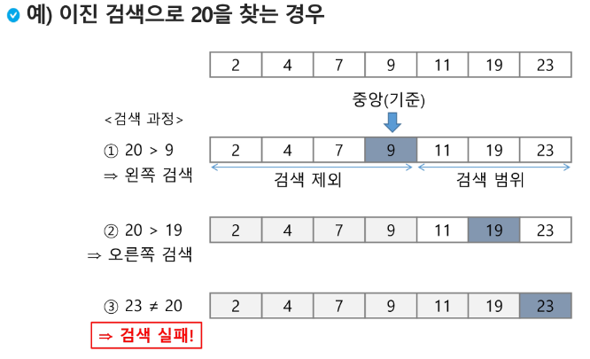

- 구현
  - 검색 범위의 시작점과 종료점을 이용하여 검색을 반복 수행한다.
  - 이진 검색의 경우, 자료에 삽입이나 삭제가 발생했을 때 배열의 상태를 항상 정렬 상태로 유지하는 추가 작업이 필요하다.
~~~python
def binarySearch(a,N,key):
  start = 0
  end = N-1
  while start <= end : # 검색 구간이 남아있으면 
    middle = (start + end) //2
    if a[middle] == key: # 검색 성공
      return True
    elif a[middle] > key :
      end = middle -1
    else:
      start = middle +1
    return False # 검색 실패
~~~
- 재귀 함수 이용
  - 아래와 같이 재귀 함수를 이용하여 이진 검색을 구현할 수도 있다.
~~~python
def binarySearch2(a, low, high, key):
  if low > high # 검색 실패
    return False
  else : 
    middle = (low + high) //2
    if key == a[middle] : # 검색 성공
      return True
    elif key < a[millde]:
      return binarySearch2(a, low, middle-1, key)
    elif a[middle] < key :
      return binarySearch2(a, middle+1, high, key)
~~~

### 인덱스
- 인덱스란 용어는 Database에서 유래했으며, 테이블에 대한 동작 속도를 높여주는 자료 구조를 일컫는다. Database 분야가 아닌 곳에서는 Look up table 등의 용어를 사용하기도 한다.
- 인덱스를 저장하는데 필요한 디스크 공간은 보통 테이블을 저장하는데 필요한 디스크 공간보다 작다. 왜냐하면 보통 인덱스는 키-필드만 갖고 있고, 테이블의 다른 세부 항목들은 갖고 있지 않게 때문이다.

- 배열을 사용한 인덱스 
  - 대량의 데이터를 매번 정렬하면, 프로그램의 반응은 느려질 수 밖에 없다. 이러한 대량 데이터의 성능 저하 문제를 해결하기 위해 배열 인덱스를 사용할 수 있다.
  
### 선택 정렬(Selection Sort)
- 주어진 자료들 중 가장 작은 값의 원소부터 차례대로 선택하여 위치를 교환하는 방식
- 앞서 살펴본 셀렉션 알고리즘을 전체 자료에 적용한 것이다.
- 정렬 과정
  - 주어진 리스트 중에서 최소값을 찾는다.
  - 그 값을 리스트의 맨 앞에 위치한 값과 교환한다.
  - 맨 처음 위치를 제외한 나머지 리스트를 대상으로 위의 과정을 반복한다.
- 시간 복잡도
- O(n2)
~~~python
def selectionSort(a,N) :
  for i in range(N-1):
    minIdx = i # 맨 앞이 제일 작다고 가정
    for j in range(i+1, N): 
      if a[minIdx] > a[j]: # 작은애랑 다음애랑 비교해서
        minIdx = j # a[j]가 제일 작다한 애보다 작으면 
    a[i], a[minIdx] = a[minIdx], a[i] # 자리를 바꿔라 
~~~
- 저장되어 있는 자료로부터 k번째로 큰 혹은 작은 원소를 찾는 방법을 셀렉션 알고리즘이라 한다.
  - 최소값, 최대값 혹은 중간값을 찾는 알고리즘을 의미하기도 한다.
- 선택 과정
  - 셀렉션은 아래와 같은 과정을 통해 이루어진다.
    - 정렬 알고리즘을 이용하여 자료 정렬하기
    - 원하는 순서에 있는 원소 가져오기

ex) K번째로 작은 원소를 찾는 알고리즘
- 1번부터 k번째까지 작은 원소들을 찾아 배열의 앞쪽으로 이동시키고, 배열의 k번째를 반환한다.
- k가 비교적 작을 때 유용하며 O(kn)의 수행시간을 필요로 한다.
~~~python
def select(arr, k) :
  for i in range(0,k) :
    minIndex = i
    for j in range(i+1, len(arr)):
      if arr[minIndex] > arr[j]:
        minIndex = j
    arr[i], arr[minIndex] = arr[minIndex], arr[i]
  return arr[k-1]
~~~

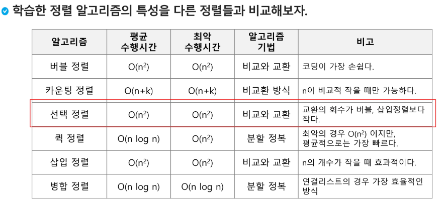