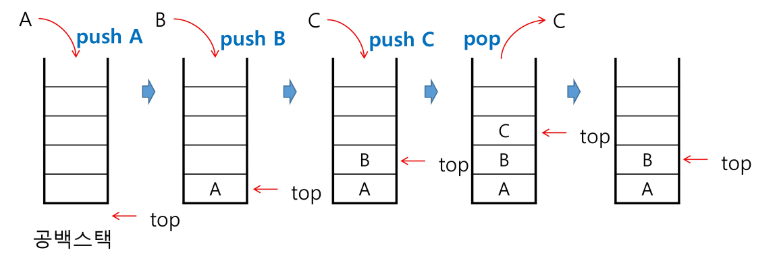
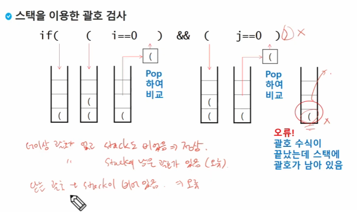
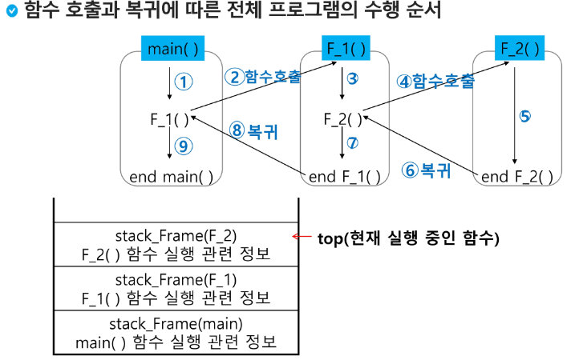
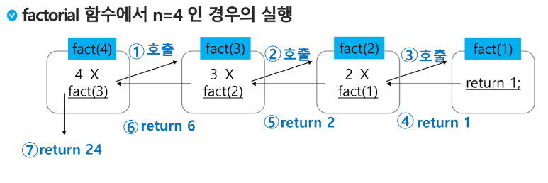
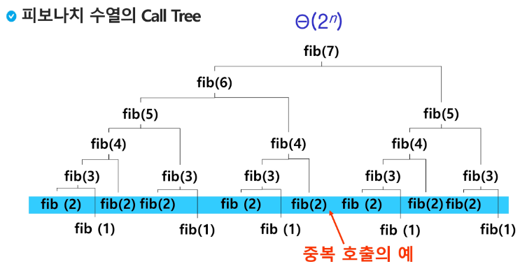
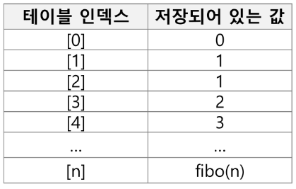
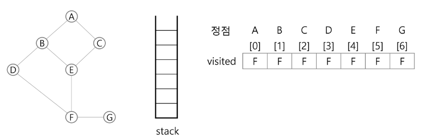
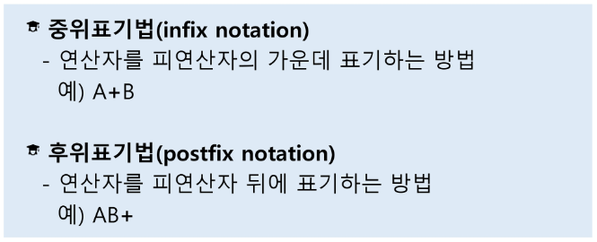
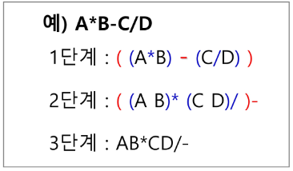
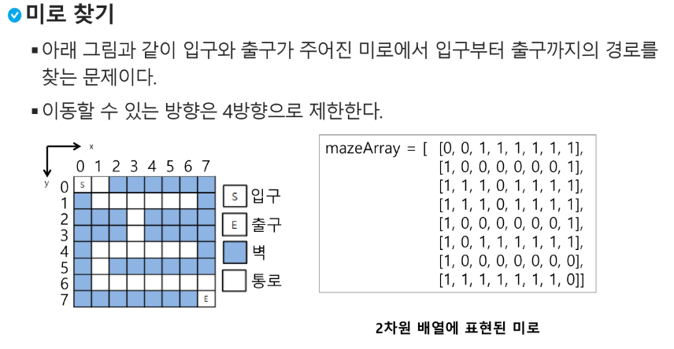

## 스택(stack)

### 스택
- 스택의 특성
- 물건을 쌓아 올리듯 자료를 쌓아 올린 형태의 자료구조이다.
- 스택에 저장된 자료는 선형 구조를 갖는다.
  - 선형구조 : 자료 간의 관계가 1 대 1의 관계를 갖는다.
  - 비선형구조 : 자료 간의 관계가 1대N의 관계를 갖는다.(예:트리)
- 스택에 자료를 삽입하거나 스택에서 자료를 꺼낼 수 있다.
- 마지막에 삽입된 자료를 가장 먼저 꺼낸다. 후입선출(LIFO, Last-In-First-Out)
  - 예를들어 스택에 1,2,3 순으로 자료를 삽입한 후 꺼내면 역순으로 즉 3,2,1 순으로 꺼낼 수 있다.

- 스택을 프로그램에서 구현하기 위해서 필요한 자료구조와 연산
  - 자료구조 : 자료를 선형으로 저장할 저장소
    - 배열을 사용할 수 있다.
    - 저장소 자체를 스택이라 부르기도 한다.
    - 스택에서 마지막 삽입된 원소의 위치를 top이라고 부른다.
- 연산 : 저장소에서 자료를 저장한다. 보통 push라고 부른다.
- 삭제 : 저장소에서 자료를 꺼낸다. 꺼낸 자료는 삽입한 자료의 역순으로 꺼낸다. 보통 pop이라고 부른다.
- 스택이 공백인지 아닌지를 확인하는 연산.isEmpty
- 스택의 top에 있는 item(원소)을 반환하는 연산.peek

- 스택의 삽입/삭제 과정
  - 빈 스택에서 원소 A,B,C 를 차례로 삽입 후 한번 삭제하는 연산 과정

- 스택의 push 알고리즘
  - append 메소드를 통해 리스트의 마지막에 데이터를 삽입
~~~python
def push(item):
    s.append(item)
~~~
~~~python
# 예시, append는 느리고, 사이즈를 정할 수 없음 
def push(item, size):
    global top
    top += 1
    if top == size:
        print('Overflow!')
    else:
        stack[top] = item

size = 10
stack = [0] * size
top = -1

push(10,size)
top += 1        # push(20)
stack[top] = 20 #
~~~

- 스택의 pop 알고리즘
~~~python
def pop() :
    if len(s) == 0 :
        #underflow
        return 
    else :
        return s.pop()
~~~
~~~python
def pop():
    global top
    if top == -1:
        print('underflow')
        return 0
    else:
        top -= 1
        return stack[top+1]

print(pop())

if top > -1: #pop()
    top -=1
    print(stack[top+1])
~~~

ex) 연습문제
~~~python 
# 스택을 구현, 구현한 스택을 이용하여 3개의 데이터를 스택에 저장하고 다시 3번 꺼내서 출력

stack = [0] * 3
top = -1

#push(10)
top += 1
stack[top] = 10

#push(20)
top += 1
stack[top] = 20

#push(30)
top += 1
stack[top] = 30

top -= 1
print(stack[top+1])

top -= 1
print(stack[top+1])

top -= 1
print(stack[top+1])
~~~

- 스택 구현 고려 사항
  - 1차원 배열을 사용하여 구현할 경우 구현이 용이하다는 장점이 있지만 스택의 크기를 변경하기가 어렵다는 단점이 있다.
  - 이를 해결하기 위한 방법으로 저장소를 동적으로 할당하여 스택을 구현하는 방법이 있다
  - 동적 연결리스트를 이용하여 구현하는 방법을 의미
  - 구현이 복잡하다는 단점이 있지만 메모리를 효율적으로 사용한다는 장점이 있음
  - 스택의 동적 구현은 생략한다.

#### 스택의 응용1 : 괄호검사
- 괄호의 종류 : 대, 중, 소 괄호
- 조건 
- (1) 왼쪽 괄호 개수와 오른쪽 괄호의 개수가 같아야 한다.
- (2) 같은 괄호에서 왼쪽 괄호는 오른쪽 괄호보다 먼저 나와야 한다.
- (3) 괄호 사이에는 포함 관계만 존재한다.

- 괄호를 조사하는 알고리즘 개요
- 문자열에 있는 괄호를 차례대로 조사하면서 왼쪽 괄호를 만나면 스택에 삽입하고, 오른쪽 괄호를 만나면 스택에서 top 괄호를 삭제한 후 오른쪽 괄호와 짝이 맞는지를 검사한다.
- 이 때, 스택이 비어 있으면 조건1 or 조건2에 위배되고 괄호의 짝이 맞지 않으면 조건3에 위배된다.
- 마지막 괄호까지를 조사한 후에도 스택에 괄호가 남아 있으면 조건 1에 위배된다.

#### 스택의 응용2 : function call
- Function call
- 프로그램에서의 함수 호출과 복귀에 따른 수행 순서를 관리
  - 가장 마지막에 호출된 함수가 가장 먼저 실행을 완료하고 복귀하는 후입선출 구조이므로, 후입선출 구조의 스택을 이용하여 수행순서 관리
  - 함수 호출이 발생하면 호출한 함수 수행에 필요한 지역변수, 매개변수 및 수행 후 복귀할 주소 등의 정보를 스택 프레임(stack frame)에 저장하여 시스템 스택에 삽입
  - 함수의 실행이 끝나면 시스템 스택의 top 원소(스택 프레임)를 삭제(pop) 하면서 프레임에 저장되어 있던 복귀주소를 확인하고 복귀
  - 함수 호출과 복귀에 따라 이 과정을 반복하여 전체 프로그램 수행이 종료되면 시스템 스택은 공백 스택이 된다.

### 재귀호출
- 자기 자신을 호출하여 순환 수행되는 것
- 함수에서 실행해야 하는 작업의 특성에 따라 일반적인 호출방식보다 재귀호출방식을 사용하여 함수를 만들면 프로그램의 크기를 줄이고 간단하게 작성
#### 예 ) factorial
  - n에 대한 factional : 1부터 n까지의 모든 자연수를 곱하여 구하는 연산
  - 마지막에 구한 하위 값을 이용하여 상위 값을 구하는 작업을 반복

#### 예 ) 피보나치
- 0과 1로 시작하고 이전의 두 수 합을 다음 항으로 하는 수열을 피보나치라 한다.
  - 0,1,1,2,3,5,8,13,...
- 피보나치 수열의 i번째 값을 계산하는 함수 F를 정의하면 다음과 같다.
- 피보나치 수열의 i번째 항을 반환하는 함수를 재귀함수로 구현할 수 있다.
~~~python
def fibo(n) :
  if n < 2 :
    return n
  else : 
    return fibo(n-1) + fino(n-2)
~~~

### Memoization
- 재귀함수의 단점 : 엄청난 중복 호출이 존재

- 메모이제이션(memoization)은 컴퓨터 프로그램을 실행할 때 이전에 계산한 값을 메모리에 저장해서 매번 다시 계산하지 않도록 하여 전체적인 실행속도를 빠르게 하는 기술. **동적 계획법(DP)의 핵심 기술**
- memoization은 글자 그대로 해석하면 메모리에 넣기(to put in memory)라는 의미이며, 기억되어야 할 것이라는 뜻의 라틴어 memorandum에서 파생되었다. 흔히 기억하기, 암기하기 라는 뜻의 memorization과 혼동한다. 동사형은 memoize이다.

- 앞의 예에서 피보나치 수를 구하는 알고리즘에서 fibo(n)의 값을 계산하자마자 저장하면(memoize), 실행시간을 줄일 수 있다.
#### Memoization 방법을 적용한 알고리즘 
~~~python 
# memo를 위한 배열을 할당하고, 모두 0으로 초기화 한다.
# memo[0]을 0으로 memo[1]는 1로 초기화 한다.
def fibo1(n):
  global memo
  if n >= 2 and memo[n] == 0 :
    memo[n] = (fibo1(n-1) + fibo1(n-2))
    return meno[n]

memo = [0]*(n+1)
meno[0] = 0
memo[1] = 1
~~~

### DP
- DP(Dynamic Programming) 동적계획 알고리즘은 그리디 알고리즘과 같이 최적화 문제를 해결하는 알고리즘이다.
- 동적 계획 알고리즘은 먼저 입력 크기가 작은 부분 문제들을 모두 해결한 후에 그 해들을 이용하여 보다 큰 크기의 부분 문제들을 해결하여, 최종적으로 원래 주어진 입력의 문제를 해결하는 알고리즘이다.

#### 피보나치 수 DP 적용
- 피보나치 수는 부분 문제의 답으로부터 본 문제의 답을 얻을 수 있으므로 최적 부분 구조로 이루어져 있다.

1. 문제를 부분 문제로 분할한다.
   - Fibo(n)의 함수는 Fibo(n-1) + Fibo(n-2)의 합...
2. 부분 문제로 나누는 일을 끝냈으면 가장 작은 부분 문제부터 해를 구한다.
3. 그 결과는 테이블에 저장하고, 테이블에 저장된 부분 문제의 해를 이용하여 상위 문제의 해를 구한다.

#### 피보나치 수 DP 적용 알고리즘
~~~python
def fibo2(n) :
  f = [0] * (n +1)
  f[0] = 0
  f[1] = 1
  for i in range(2, n+1):
    f[i] = f[i-1] + f[i-2]

  return f[n]
~~~
- DP의 구현 방식
  - recursive 방식 : fib1()
  - iterative 방식 : fib2()
  - memoization을 재귀적 구조에 사용하는 것 보다 반복적 구조로 DP를 구현한 것이 성능 면에서 보다 효율적이다.
  - 재귀적 구조는 내부에 시스템 호출 스택을 사용하는 오버헤드가 발생하기 때문이다.

#### 재귀 연습1
~~~python
f(i,k) # i = 현재 상태 / k = 목표
if i == k : # 목표도달
  return
else 
  f(i+1,k) # 다음 단계
~~~

### DFS
- 비선형적인 그래프 구조는 그래프로 표현된 모든 자료를 빠짐없이 검색하는 방법이 중요함
- 두가지 방법
  - 깊이 우선 탐색(Depth First Search, DFS)
  - 너비 우선 탐색(Breadth First Search, BFS)
  - 시작 정점의 한 방향으로 갈 수 있는 경로가 있는 곳까지 깊이 탐색해 가다가 더 이상 갈 곳이 없게 되면, 가장 마지막에 만났던 갈림길 간선이 있는 정점으로 되돌아와서 다른 방향의 정점으로 탐색을 계속 반복하여 결국 모든 정점을 방문하는 순회방법
  - 가장 마지막에 만났던 갈림길의 정점으로 되돌아가서 다시 깊이 우선 탐색을 반복해야 하므로 후입선출 구조의 스택 사용
  
1. 시작 정점 v를 결정하여 방문한다.
2. 정점 v에 인접한 정접 중에서
   1) 방문하지 않은 정점 w가 있으면, 정점 v를 스택에 push하고 정점 w를 방문한다. 그리고 w를 v로 하여 다시 2.를 반복한다.
   2) 방문하지 않은 정점이 없으면, 탐색의 방향을 바꾸기 위해서 스택을 pop하여 받은 가장 마지막 방문 정점을 v로 하여 다시 2.를 반복한다.
   3) 스택이 공백이 될 때까지 2.를 반복한다.

~~~python
visted[], stack[] 초기화
DFS(v)
    시작점 v 방문;
    visited[v]
    while{
      if (v의 인접 정점 중 방문 안한 정점 w가 있으면)
        push(v)
        v <- w
        visited[w] <- True:
      else
        if (스택이 비어 있지 않으면)
          v <- pop(stack)
        else
          break
    }
end DFS()
~~~
#### DFS 예

0. 초기상태 : 배열 visited를 False로 초기화하고, 공백 스택을 생성
1. 정점 A를 시작으로 깊이 우선 탐색을 시작
~~~
A 방문 :
visited[A] <- True 
~~~
2. 정점 A에서 방문하지 않은 정점 B,C가 있으므로 A를 스택에 push 하고, 인접정점 B와 C 중에서 오름차순에 따라 B를 선택하여 탐색을 계속한다.
~~~
push(A):
B 방문
visited[B] <- True
~~~
3. 정점 B에 방문하지 않은 정점 D,E가 있으므로 B를 스택에 push 하고, 인접정점 D와 E 중에서 오름차순에 따라 D를 선택하여 탐색을 계속한다
~~~
push(B):
D 방문
visited[D] <- True
~~~
4. 정점 D에 방문하지 않은 정점 F가 있으므로 D를 스택에 push하고, 인접정점 F를 선택하여 탐색을 계속한다.
~~~
push(D):
F 방문
visited[F] <- True
~~~
5. 정점 F에 방문하지 않은 정점 E,G가 있으므로 F를 스택에 push하고, 인접정점 E와 G 중에서 오름차순에 따라 E를 선택하여 탐색을 계속한다.
~~~
push(F):
E 방문
visited[E] <- True
~~~
6. 정점 E에 방문하지 않은 정점 C가 있으므로 E를 스택에 push하고, 인접정점 C를 선택하여 탐색을 계속한다
~~~
push(E):
C 방문
visited[C] <- True
~~~
7. 정점 C에서 방문하지 않은 인접정점이 없으므로, 마지막 정점으로 돌아가기 위해 스택을 pop 하여 받은 정점 E에 대해서 방문하지 않은 인접정점이 있는지 확인한다.
~~~
pop(stack)
~~~
8. 정점 E는 방문하지 않은 인접정점이 없으므로, 다시 스택을 pop하여 받은 정점 F에 대해서 방문하지 않은 인접정점이 있는지 확인한다.
~~~
pop(stack)
~~~
9. 정점 F에 방문하지 않은 정점 G가 있으므로 F를 스택에 push하고, 인접정점 G를 선택하여 탐색을 계속한다.
~~~
push(F):
G 방문
visited[G] <- True
~~~
10. 정점 G는 방문하지 않은 인접정점이 없으므로, 마지막 정점으로 돌아가기 위해 스택을 pop하여 받은 정점 F에 대해서 방문하지 않은 인접정점이 있는지 확인한다
~~~
pop(stack)
~~~
11. 정점 F는 방문하지 않은 인접정점이 없으므로, 마지막 정점으로 돌아가기 위해 스택을 pop하여 받은 정점 D에 대해서 방문하지 않은 인접정점이 있는지 확인한다
~~~
pop(stack)
~~~
12. 정점 D는 방문하지 않은 인접정점이 없으므로, 마지막 정점으로 돌아가기 위해 스택을 pop하여 받은 정점 B에 대해서 방문하지 않은 인접정점이 있는지 확인한다
~~~
pop(stack)
~~~
13. 정점 B는 방문하지 않은 인접정점이 없으므로, 마지막 정점으로 돌아가기 위해 스택을 pop하여 받은 정점 A에 대해서 방문하지 않은 인접정점이 있는지 확인한다
~~~
pop(stack)
~~~
14. 정점 A는 방문하지 않은 인접정점이 없으므로, 마지막 정점으로 돌아가기 위해 스택을 pop하는데, 스택이 공백이므로 깊이 우선 탐색을 종료한다.
15. 최종 : 깊이 우선 탐색 경로 : A-B-D-F-E-C-G

~~~python
'''
7 8 
1 2 1 3 2 4 2 5 4 6 5 6 6 7 3 7
'''
V, E = map(int,input().split())
adjM = [[0]*(V+1) for _ in range(V+1)]
for i in range(E):
  v1,v2 = arr[i*2],arr[i*2+1]
  adjM[v1][v2] = 1
  adjM[v2][v1] = 1
~~~
## 스택2

### 계산기1
- 문자열로 된 계산식이 주어질 때, 스택을 이용하여 이 계산식의 값을 계산할 수 있다.
- 문자열 수식 계산의 일반적 방법
1. 중위 표기법의 수식을 후위 표기법으로 변경한다.(스택이용)
2. 후위 표기법의 수식을 스택을 이용하여 계산한다

STEP1. 중위표기식의 후위표기식 변환 방법1
   - 수식의 각 연산자에 대해서 우선순위에 따라 괄호를 사용하여 다시 표현한다.
   - 각 연산자를 그에 대응하는 오른쪽괄호의 뒤로 이동시킨다.
   - 괄호를 제거한다

STEP1. 중위 표기법에서 후위 표기법으로의 변환 알고리즘(스택 이용)2
1. 입력 받은 중위 표기식에서 토큰을 읽는다.
2. 토큰이 피연산자이면 토큰을 출력한다.
3. 토큰이 연산자(괄호포함)일 떄, 이 토큰이 스택의 top에 저장되어 있는 연산자보다 우선순위가 높으면 스택에 push하고, 그렇지 않으면 스택 top의 연산자의 우선순위가 토큰의 우선순위보다 작을 때까지 스택에서 pop 한 후 토큰의 연산자를 push한다. 만약 top에 연산자가 없으면 push한다.
4. 토큰이 오른쪽 괄호')' 이면 스택 top에 왼쪽 괄호'('가 올 때까지 스택에 pop 연산을 수행하고 pop한 연산자를 출력한다. 왼쪽 괄호를 만나면 pop만 하고 출력하지는 않는다.
5. 중위 표기식에서 더 읽은 것이 없다면 중지하고, 더 읽을 것이 있다면 1부터 다시 반복한다.
6. 스택에 남아 있는 연산자를 모두 pop하여 출력한다.
  - 스택 밖의 왼쪽 괄호는 우선 순위가 가장 높으며, 스택 안의 왼쪽 괄호는 우선 순위가 가장 낮다.
  
### 계산기2
STEP2. 후위 표기법의 수식을 스택을 이용하여 계산
1. 피연산자를 만나면 스택에 push 한다.
2. 연산자를 만나면 필요한 만큼의 피연산자를 스택에서 pop하여 연산하고, 연산결과를 다시 스택에 push한다.
3. 수식이 끝나면, 마지막으로 스택을 pop하여 출력한다.
   
### 백트래킹
- 백트래킹 기법은 해를 찾는 도중에 '막히면' (즉, 해가 아니면) 되돌아가서 다시 해를 찾아 가는 기법이다.
- 백트래킹 기법은 최적화(optimization) 문제와 결정(decision) 문제를 해결할 수 있다.
- 결정 문제 : 문제의 조건을 만족하는 해가 존재하는지의 여부를 yes or no가 답하는 문제
  - 미로 찾기
  - n-Queen 문제
  - Map coloring
  - 부분 집합의 합(Subset Sum) 문제 등

#### 미로찾기

#### 백트래킹과 깊이우선탐색과의 차이
- 어떤 노드에서 출발하는 경로가 해결책으로 이어질 것 같지 않으면 더 이상 그 경로를 따라가지 않음으로써 시도의 횟수를 줄임(prunning 가지치기)
- 깊이우선탐색이 모든 경로를 추적하는데 비해 백트래킹은 불필요한 경로를 조기에 차단.
- 깊이우선탐색을 가하기에는 경우의 수가 너무 많음. 즉, n! 가지의 경우의 수를 가진 문제에 대해 깊이우선탐색을 가하면 당연히 처리 불가능한 문제.
- 백트래킹 알고리즘을 적용하면 일반적으로 경우의 수가 줄어들지만 이 역시 최악의 경우에는 여전히 지수함수 시간(Exponential Time)을 요하므로 처리불가능
- 모든 후보를 검사?
  - No!!
- 백트래킹 기법
  - 어떤 노드의 유망성을 점검한 후에 유망(promising)하지 않아도 결정되면 그 노드의 부모로 돌아가(backtracking) 다음 자식 노드로 감
  - 어떤 노드를 방문하였을 때 그 노드를 포함한 경로가 해답이 될 수 없으면 그 노드는 유망하지 않다고 하며, 반대로 해답의 가능성이 있으면 유망하다고 한다.
  - 가지치기(pruning: 유망하지 않는 노드가 포함되는 경로는 더 이상 고려하지 않는다.

#### 백트래킹 절차
1. 상태 공간 트리의 깊이 우선 탐색을 실시한다.
2. 각 노드가 유망한지를 점검한다.
3. 만일 그 노드가 유망하지 않으면, 그 노드의 부모 노드로 돌아가서 검색을 계속한다.

#### 일반 백트래킹 알고리즘
~~~python
def checknode(v):
  if promising(v):
    if there is a solution at v :
      write the solution
    else:
      for u in each child of v:
        checknode(u)
~~~
### 부분집합, 순열
#### 부분집합 구하기
- 어떤 집합의 공집합과 자기자신을 포함한 모든 부분집합을 powerset이라고 하며 구하고자 하는 어떤 집합의 원소 개수가 n일 경우 부분집합의 개수는 2^n개 이다.
- 백트래킹 기법으로 powerset을 구해보자.
  - 앞에서 설명한 일반적인 백트래킹 접근 방법을 이용한다.
  - n개의 원소가 들어있는 집합 2^n개의 부분집합을 만들 때는, true 또는 false값을 가지는 항목들로 구성된 n개의 배열을 만드는 방법을 이용
  - 여기서 배열의 i번째 원소가 부분집합의 값인지 아닌지를 나타내는 값이다.
- 각 원소가 부분집합에 포함되었는지를 loop 이용하여 확인하고 부분집합을 생성하는 방법

~~~python
bit = [0,0,0,0]
for i in range(2):
  bit[0] = i
  for j in range(2):
    bit[1] = j
    for k in range(2):
      bit[2] = k
      for l in range(2):
        bit[3] = l
        print(bit)
~~~
#### powerset을 구하는 백트래킹 알고리즘 
~~~python
def backtrack(a,k,input):
  global MAXCANDIDATES
  c = [0] * MAXCANDIDATES

  if k == input:
    process_solution(a,k)
  else:
    k += 1
    ncandidates = construct_candidates(a,k,input,c)
    for i in range(ncandidates):
      a[k] = c[i]
      backtrack(a,k,input)

def construct_candidates(a,k,input, c):
  c[0] = True
  c[1] = False
  return 2

MAXCANDIDATES = 2
NMAX = 4
a = [0]*NMAX
backtrack(a,0,3)
~~~
#### 예) {1,2,3,}을 포함하는 모든 순열을 생성하는 함수
~~~python
for i1 in range(1,4):
  for i2 in range(1,4):
    if i2 != i1:
      for i3 in range(1,4):
        if i3 != i1 and i3 != i2:
          print(i1,i2,i3)
~~~
#### 백트래킹을 이용하여 순열 구하기
~~~python
def backtrack(a, k, input):
  global MAXCANDIDATES
  c = [0] * MAXCANDIDATES

  if k == input:
    for i in range(1, k+1):
      print(a[i], end=" ")
      print()
  else:
    k += 1
    ncandidates = construct_candidates(a, k, input, c)
    for i in range(ncandidates):
      a[k] = c[i]
      backtrack(a,k, input)
def construct_candidates(a,k, input, c):
  in_perm = [False] * NMAX
  
  for i in range(1,k):
    in_perm[a[i]] == True

  ncandidates = 0
  for i in range(1, input+1):
    if in_perm[i] == False:
      c[ncandidates] = i
      ncandidates += 1
      return ncandidates
~~~

### 분할정복

