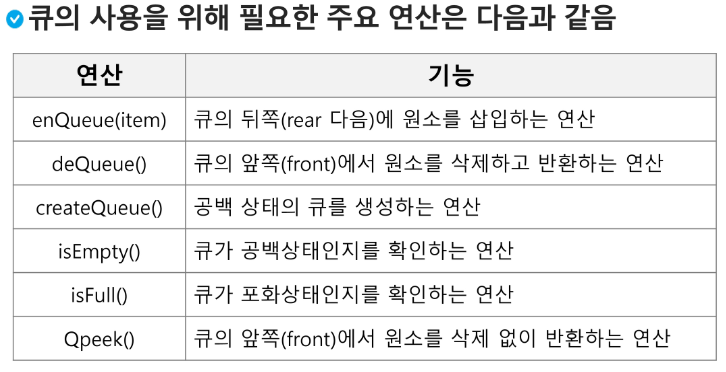
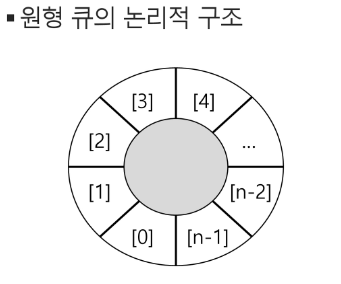
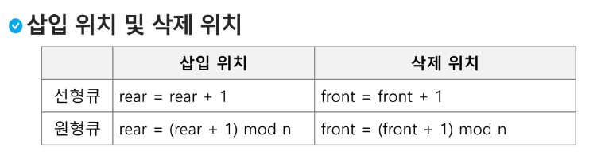
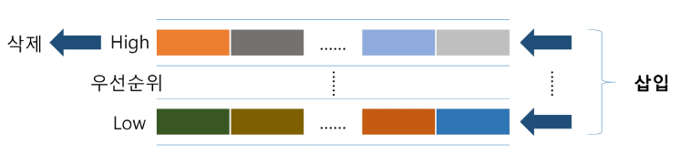
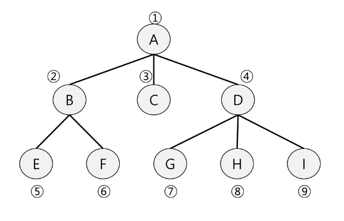

## Queue(큐)

### 큐
- 큐의 특성 : 스택과 마찬가지로 삽입과 삭제의 위치가 제한적인 자료구조
  - 큐의 뒤에서는 삽입만 하고, 큐의 앞에서는 삭제만 이루어지는 구조
- 선입선출구조(FIFO:First In First Out)
  - 큐에 삽입한 순서대로 원소가 저장되어, 가장 먼저 삽입된 원소는 가장 먼저 삭제 된다.
- 큐의 기본 연산
  - 삽입 : enQueue
  - 삭제 : deQueue

-front = rear = -1

### 선형 큐
- 1차원 배열을 이용한 큐
  - 큐의 크기 = 배열의 크기
  - front : 저장된 첫 번째 원소의 인덱스
  - rear : 저장된 마지막 원소의 인덱스

- 상태 표현
  - 초기 상태 : front == rear == -1
  - 공백 상태 : front == rear
  - 포화 상태 : rear == n-1(n:배열의 크기, n-1:배열의 마지막 인덱스)
- 초기 공백 큐 생성
  - 크기 n인 1차원 배열 생성
  - front와 rear를 -1로 초기화

### 큐의 구현
- 삽입 : enQueue(item)
- 마지막 원소 뒤에 새로운 원소를 삽입하기 위해
  1) rear 값을 하나 증가시켜 새로운 원소를 삽입할 자리를 마련
  2) 그 인덱스에 해당하는 배열원소 Q[rear]에 item 을 저장
~~~python
def enQueue(item):
    global rear_
    if isFull() : print('Queue_Full')
    else:
        rear += 1
        Q[rear] = item
~~~
- 삭제 : deQueue()
- 가장 앞에 있는 원소를 삭제하기 위해
  1) front값을 하나 증가시켜 큐에 남아있게 될 첫 번째 원소 이동
  2) 새로운 첫 번째 원소를 리턴 함으로써 삭제와 동일한 기능함
~~~python
def deQueue():
    if isEmpty() then Queue_Empty():
    else:
        front += 1
        return Q[front]
~~~

- 공백상태 및 포화상태 검사 : isEmpty(), isFull()
  - 공백상태 : front == rear
  - 포화상태 : rear == n-1(n:배열의 크기, n-1:배열의 마지막 인덱스)
~~~python
def isEmpty() :
    return front == rear
def Full() :
    return rear == len(Q) -1
~~~
- 검색 : Qpeek()
  - 가장 앞에 있는 원소를 검색하여 반환하는 연산
  - 현재 front의 한자리 뒤(front+1) 에 있는 원소, 즉 큐의 첫 번째에 있는 원소를 반환
~~~python
def Qpeek():
    if isEmpty(): print('Queue_Empty')
    else: return Q[front+1]
~~~

#### 연습문제1
큐를 구현하여 다음 동작을 확인
- 세 개의 데이터 1,2,3 을 차례로 큐에 삽입
- 차례로 꺼내서 출력(1,2,3)
~~~python
queue = [0] * 10
front = rear = -1

def enqueue(item):
    global rear
    rear += 1
    queue[rear] = item

def dequeue():
    global front
    front += 1
    return queue[front]
~~~

#### 선형 큐 이용시의 문제점
- 잘못된 포화상태 인식
  - 선형 큐를 이용하여 원소의 삽입과 삭제를 계속할 경우, 배열의 앞부분에 활용할 수 있는 공간이 있음에도 불구하고, rear = n-1 인 상태 즉, 포화상태로 인식하여 더 이상의 삽입을 수행하지 않게 됨.
- 해결방법 1
  - 매 연산이 이루어질 때마다 저장된 원소들을 배열의 앞부분으로 모두 이동시킴
  - 원소 이동에 많은 시간이 소요되어 큐의 효율성이 급격히 떨어짐
- 해결방법2
  - 1차원 배열을 사용하되, 논리적으로는 배열의 처음과 끝이 연결되어 원형 형태의 큐를 이룬다고 가정하고 사용

### 원형 큐
- 초기 공백 상태
  - front = rear = 0
- index의 순환
  - front와 rear의 위치가 배열의 마지막 인덱스인 n-1를 가리킨 후, 그 다음에는 논리적 순환을 이루어 배열의 처음 인덱스인 0으로 이동해야 함
  - 이를 위해 나머지 연산자 mod를 사용함
- front 변수
  - 공백 상태와 포화 상태 구분을 쉽게 하기 위해 front가 있는 자리는 사용하지 않고 항상 빈자리로 둠

- 초기 공백 큐 생성
  - 크기 n인 1차원 배열 생성
  - front와 rear 를 0으로 초기화
- 공백상태 및 포화상태 검사 : isEmpty(),isFull()
  - 공백상태 : front == rear
  - 포화상태 : 삽입할 rear의 다음 위치 == 현재 front
  - (rear + 1) mod n == front
~~~python
def isEmpty():
  return front == rear

def isFull():
  return (rear+1) % len(cQ) == front 
~~~

- 삽입 : enQueue(item)
  - 마지막 원소 뒤에 새로운 원소를 삽입하기 위해
1. rear 값을 조정하여 새로운 원소를 삽입할 자리를 마련함:
- rear <- (rear + 1) % n:
2. 그 인덱스에 해당하는 배열원소 cQ[rear]에 item을 저장
~~~python
def enQueue(item):
  global rear
  if isFull():
    print('Queue_Full')
  else:
    rear = (rear+1) % len(cQ)
    cQ[rear] = item
~~~
- 삭제 : deQueue(), delete()
  - 가장 앞에 있는 원소를 삭제하기 위해
1. front 값을 조정하여 삭제할 자리를 준비함
2. 새로운 front 원소를 리턴 함으로써 삭제와 동일한 기능함
~~~python
def deQueue():
  global front 
  if isEmpty():
    print('Queueu_Empty')
  else:
    front = (front+1) % len(cQ)
    return cQ[front]
~~~

### 우선 순위 큐
- 우선순위 큐의 특성
  - 우선 순위를 가진 항목들을 저장하는 큐
  - FIFO 순서가 아니라 우선순위가 높은 순서대로 먼저 나가게 된다.
- 적용 분야
  - 시뮬레이션 시스템
  - 네트워크 트래픽 제어
  - 운영체제의 테스크 스케줄링
- 우선순위 큐의 구현
  - 배열을 이용한 우선순위 큐
  - 리스트를 이용한 우선순위 큐
- 우선순위 큐의 기본 연산
  - 삽입 : enQueue
  - 삭제 : deQueue

#### 배열을 이용하여 우선순위 큐 구현
- 우선순위 큐 구현
  - 배열을 이용하여 자료 저장
  - 원소를 삽입하는 과정에서 우선순위를 비교하여 적절한 위치에 삽입하는 구조
  - 가장 앞에 최고 우선순위의 원소가 위치하게 됨
- 문제점
  - 배열을 사용하므로, 삽입이나 삭제 연산이 일어날 때 원소의 재배치가 발생함
  - 이에 소요되는 시간이나 메모리 낭비가 큼

### 큐의 활용:버퍼(Buffer)
- 버퍼
  - 데이터를 한 곳에서 다른 한 곳으로 전송하는 동안 일시적으로 그 데이터를 보관하는 메모리 영역
  - 버퍼링 : 버퍼를 활요하는 방식 또는 버퍼를 채우는 동작을 의미한다
- 버퍼의 자료 구조
  - 버퍼는 일반적으로 입출력 및 네트워크와 관련된 기능에서 이용된다.
  - 순서대로 입력/출력/전달되어야 하므로 FIFO 방식의 자료구조인 큐가 활용된다.

### BFS(Breadth First Search)
- 너비우선탐색은 탐색 시작점의 인접한 정점들을 먼저 모두 차례로 방문한 후에, 방문했던 정점을 시작점으로 하여 다시 인접한 정점들을 차례로 방문하는 방식
- 인접한 정점들에 대해 탐색을 한 후, 차례로 다시 너비우선탐색을 진행해야 하므로, 선입선출 형태의 자료구조인 큐를 활용함

~~~python
def BFS(G, v): # 그래프 G, 탐색 시작점 v
  visited = [0] * (n+1)
  queue = []
  queue.append(v)
  while queue:
    t = queue.pop(0)
    if not visited[t] :
      visitied[t] = True
      visit(t)
      for i in G[t]:
        if not visitied[i]:
          queue.append(i)
~~~

~~~python
# 이걸 기본형으로 사용하기 권장
def BFS(G,v,n): # 그래프G,탐색 시작점 v
  visited = [0]*(n+1)
  queue = []
  queue.append(v)
  visited[v] = 1
  while queue:
    t = queue.pop(0)
    visit(t)
    for i in G[t] :
      if not visited[i]
      queue.append(i)
      visited[i] = visited[n] +1
~~~

#### 연습문제3 
- 다음은 연결되어 있는 두 개의 정점 사이의 간선을 순서대로 나열 해 놓은 것이다. 모든 정점을 너비우선탐색 하여 경로를 출력하시오. 시작 정점을 1로 시작하시오
- 1,2,1,3,2,4,2,5,4,6,5,6,6,7,3,7
- 출력 결과 : 1-2-3-4-5-7-6

~~~python
'''
7 8
1 2 1 3 2 4 2 5 4 6 5 6 6 7 3 7
'''
def bfs(v, N): # 마지막 정점 N
  visited = [0] *(N+1) # visited 생성
  queue = []# queue 생성
  queue = [v] # 시작점 인큐
  visitedpv[v] = 1 # 시작점 인큐 표시
  while queue: # 큐가 비어질때 까지
    t = queue.pop(0) # 디큐
    print(t, end = ' ') # t에서 처리할 일
    for v in adjL[t] :# t에 인점이고 방문한 적 없는 v
      if visited[v] == 0:
        queue.append(v)# v 인큐
        visited[v] = visited[t] + 1 # v 인큐 표시
~~~

V, E = map(int, input().split())
arr = list(map(int, input().split()))
adjL = [[] for _ in range(V+1)]
for i in range(E):
  n1,n2 = arr[i*2], arr[i*2+1]
  adjL[n1].append(n2)
  adjL[n2].append(n1)

bfs(1, V) # 시작정점 1, V, 마지막 정점
