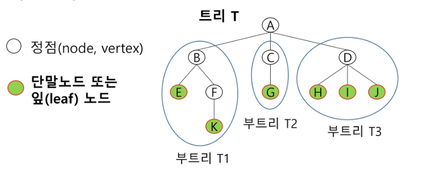
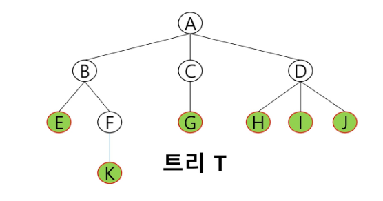
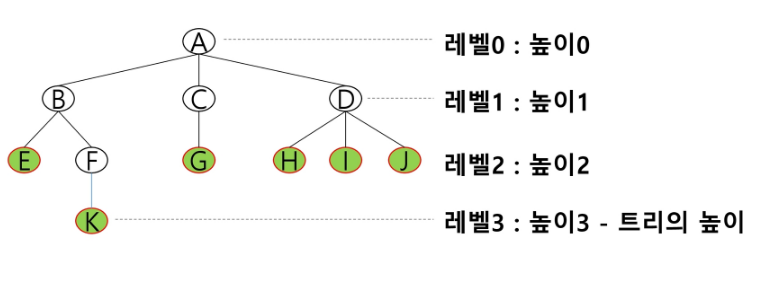
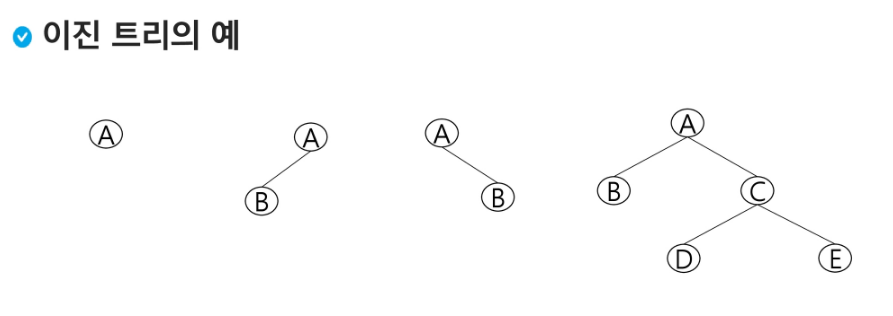
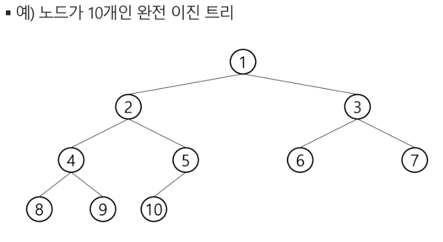

## 트리(Tree)

### 트리
- 트리의 개념
    - 비선형 구조
    - 원소들 간에 1:n 관계를 가지는 자료구조
    - 원소들 간에 계층관계를 가지는 계층형 자료구조
    - 상위 원소에서 하위 원소로 내려가면서 확장되는 트리(나무)모양의 구조

- 한 개 이상의 노드로 이루어진 유한 집합이며 다음 조건을 만족한다.
    - 노드 중 최상위 노드를 루트(root)라 한다.
    - 나머지 노드들은 n(>=0)개의 분리 집합 T1, T2...TN으로 분리 될 수 있다.
- 이들 T1, T2, ... TN은 각각 하나의 트리가 되며(재귀적 정의) 루트의 부 트리(subtree)라 한다.

트리 용어 정리

- 노드(node) - 트리의 원소
    - 트리 T의 노드 = A,B,C,D,E,F,G,H,I,J,K
- 간선(edge) - 노드를 연결하는 선. 부모 노드와 자식 노드의 연결
- 루트 노드(root node) - 트리의 시작 노드
    - 트리 T의 루트노드 - A
- 형제 노드(sibling node) - 같은 부모 노드의 자식 노드들
    - B,C,D는 형제 노드
- 조상 노드 - 간선을 따라 루트 노드까지 이르는 경로에 있는 모든 노드들 
    - K의 조상 노드 : F,B,A
- 서브 트리(subtree) - 부모 노드와 연결된 간선을 끊었을 때 생성되는 트리
- 자손 노드 - 서브 트리에 있는 하위 레벨의 노드들
    - B의 자손 노드 - E,F,K
- 차수(degree)
    - 노드의 차수 : 노드에 연결된 자식 노드의 수
        - B의 차수 = 2, C의 차수 = 1
    - 트리의 차수 : 트리에 있는 노드의 차수 중에서 가장 큰 값
        - 트리 T의 차수 = 3
    - 단말 노드(리프 노드) : 차수가 0인 노드, 자식 노드가 없는 노드
- 높이
    - 노드의 높이 : 루트에서 노드에 이르는 간선의 수, 노드의 레벨
        - B의 높이 = 1, F의 높이 = 2
    - 트리의 높이 : 트리에 있는 노드의 높이 중에서 가장 큰 값, 최대 레벨
        - 트리 T의 높이 = 3

### 이진 트리
- 모든 노드들이 2개의 서브트리를 갖는 특별한 형태의 트리
- 각 노드가 자식 노드를 최대한 2개 까지만 가질 수 있는 트리
    - 왼쪽 자식 노드(left child node)
    - 오른족 자식 노드(right child node)

이진 트리 - 특성
- 레벨 i에서의 노드의 최대 개수는 2개
- 높이가 h인 이진 트리가 가질 수 있는 (h+1)개가 되며, 최대 개수는 (2^h+1 -1)개가 된다

이진 트리 - 종류
1. 포화 이진 트리(Full Binary Tree)
    - 모든 레벨에 노드가 포화상태로 차 있는 이진 트리
    - 높이가 h일 때, 최대의 노드 개수인(2^h+1 -1)의 노드를 가진 이진 트리
        - 높이 3일 때 2^3+1 -1 = 15개의 노드
    - 루트를 1번으로 하여 2^h+1 -1 까지 정해진 위치에 대한 노드 번호를 가짐

2. 완전 이진 트리(Complete Binary Tree)
- 높이가 h이고 노드 수가 n개일 때(단, h+1 <= n < 2^h+1 -1), 포화 이진 트리의 노드 번호 1번부터 n번까지 빈 자리가 없는 이진 트리

### 이진 트리의 표현

#### [참고] 이진 트리의 저장

### 이진탐색 트리

### 힙