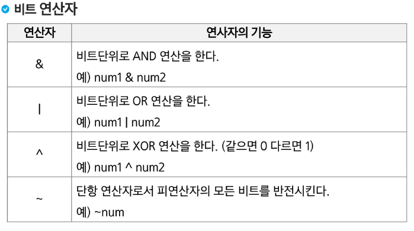
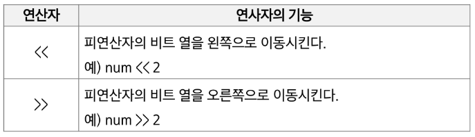
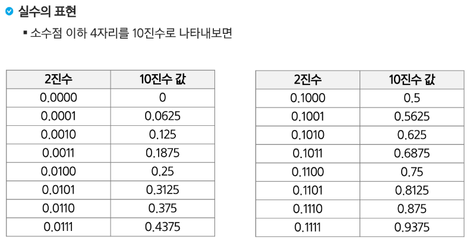

## Start

### 비트연산자

1. AND 연산
- 비트 검사, 특정 비트를 0으로 만들 때
2. OR 연산 
- 특정 비트를 1로 만들 때
3. XOR 연산
- 특정 비트를 반전 시킬 때
4. ~ 연산
- 단항 연산자로 모든 비트를 반전시킬 때
5. << >> 쉬프트 연산
- 비트를 옮겨간다.

1 << n
- 2n의 값을 갖는다
- 원소가 n개일 경우의 모든 부분집합의 수를 의미한다.
- Power set(모든 부분 집합)
  - 공집합과 자기 자신을 포함한 모든 부분집합
  - 각 원소가 포함되거나 포함되지 않는 2가지 경우의 수를 계산하면 모든 부분집합의 수가 계산된다.

i & (1 << j)
- 계산 결과는 i의 j번째 비트가 1인지 아닌지를 의미한다.

#### 비트 연산 예제1
~~~python
def Bbit_print(i):
    output = ''
    for j in range(7,-1,-1) :
        output += '1' if i & (1 << j) else '0'
    print(output)

for i in range(-5,6):
    print('%3d = ' % i, end='')
    Bbit_print(i)
~~~

#### 비트 연산 예제2
~~~python
def Bbit_print(i):
    output = ''
    for j in range(7,-1,-1) :
        output += '1' if i & (1 << j) else '0'
    print(output, end='')
a =0x10
x = 0x01020304
print('%3d = ' % i, end='')
Bbit_ptint(a)
print()
print('0%X = ', end='')
for i in range(0,4):
    Bbit_print((x >> i*8)& 0xff)
~~~

### 엔디안(Endianness)
- 컴퓨터의 메모리와 같은 1차원의 공간에 여러 개의 연속된 대상을 배열하는 방법을 의미하며 HW 아키텍처마다 다르다.
- 주의 : 속도 향상을 위해 바이트 단위와 워드 단위를 변환하여 연산 할 때 올바로 이해하지 않으면 오류를 발생 시킬 수 있다.
- 엔디안은 크게 두 가지로 나뉨
  - 빅 엔디안(Big-endian) : 보통 큰 단위가 앞에 나옴. 네트워크
  - 리틀 엔디안(Little-endian) : 작은 단위가 앞에 나옴. 대다수 데스크탑 컴퓨터

#### 비트 연산 예제3
~~~python
def ce(n) : #change endian
    p = []
    for i in range(0,4):
        p.append((n>>(24 - (i*8))) & 0xff)
    return p

x = 0x01020304
p = []
for i in range(0,4):
    p.append((x >> (i*8)) & 0xff)

print("x= %d%d%d%d" % (p[0],p[1],p[2],p[3]))
p = ce(x)
print("x= %d%d%d%d" % (p[0],p[1],p[2],p[3]))
~~~

#### 비트 연산 예제4
~~~python
def ce1(n):
    return (n << 24 & 0xff000000) | (n << & 0xff0000)
    | (n >> 8 & 0xff00) | (n >> 24 & 0xff)
~~~

### 진수
- 2진수, 8진수, 10진수, 16진수

10 진수 -> 타 진수로 변환
- 원하는 타진법의 수로 나눈 뒤 나머지를 거꾸로 읽는다.

#### 컴퓨터에서의 음의 정수 표현 방법
- 1의 보수 : 부호와 절대값으로 표현된 값을 부호 비트를 제외한 나머지 비트들을 0은 1로, 1은 0으로 변환한다
- 2의 보수 : 1의 보수방법으로 표현된 값의 최하위 비트에 1을 더한다.

### 실수
실수의 표현 

- 컴퓨터는 실수를 표현하기 위해 부동 소수점(floating-point) 표기법을 사용한다.
- 부동 소수점 표기 방법은 소수점의 위치를 고정시켜 표현하는 방식이다.
- 