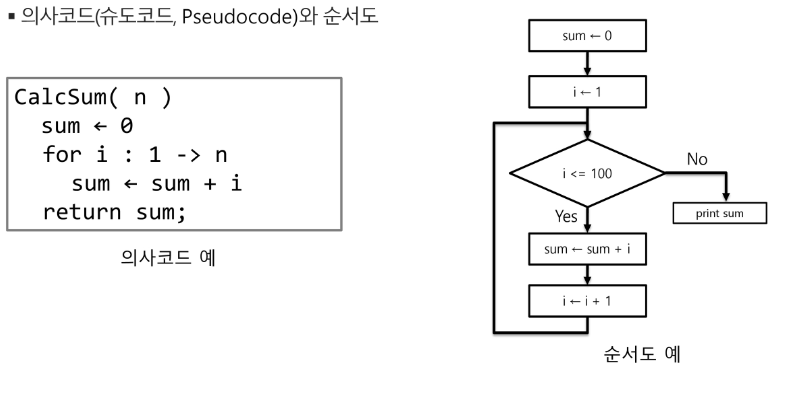
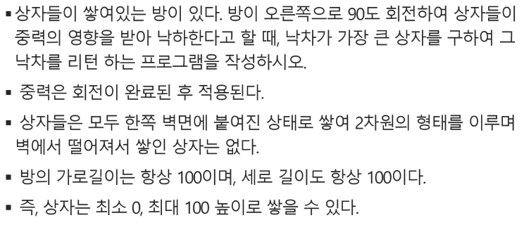
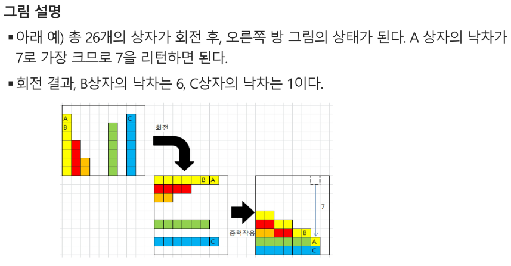
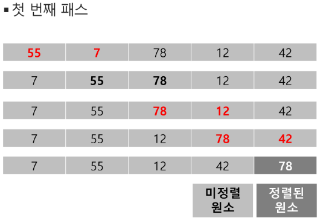
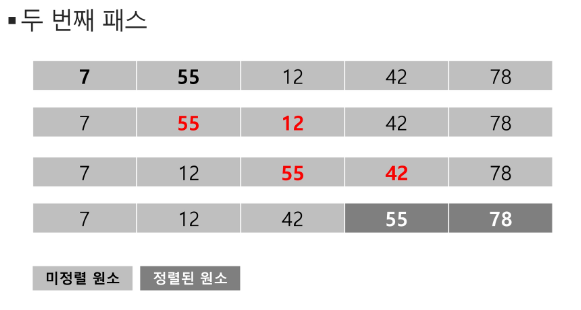
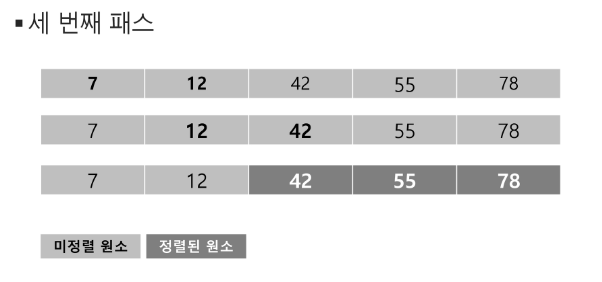
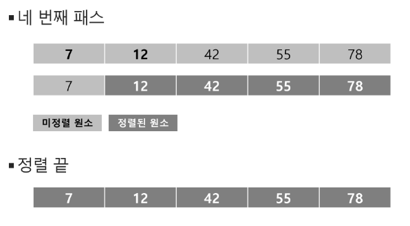
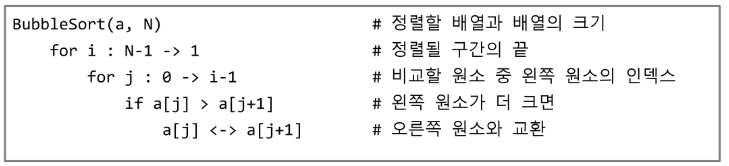

# 알고리즘 _List

## 배열1(Array 1)

### 알고리즘
- 알고리즘 : 유한한 단계를 통해 문제를 해결하기 위한 절차나 방법
- 컴퓨터가 어떤 일을 수행하기 위한 단계적 방법
- 어떠한 문제를 해결하기 위한 절차

#### 좋은 알고리즘
1. 정확성 : 얼마나 정확하게 동작하는가
2. 작업량 : 얼마나 적은 연산으로 원하는 결과를 얻어내는가
3. 메모리 사용량 : 얼마나 적은 메모리를 사용하는가
4. 단순성 : 얼마나 단순한가
5. 최적성 : 더 이상 개선할 여지없이 최적화되었는가

- 어떤 알고리즘을 사용해야 하는가? -> 알고리즘의 성능 분석 필요 
  - 많은 문제에서 성능 분석의 기준으로 알고리즘의 작업량을 비교한다.
- 알고리즘의 작업량을 표현할 때 시간복잡도로 표현한다.
  - 시간 복잡도(Time Complexity)
  - 실제 걸리는 시간을 측정
  - 실행되는 명령문의 개수로 계산
#### 빅-오(O) 표기법 : 시간 복잡도
- 시간 복잡도 함수 중에서 가장 큰 영향력을 주는 n에 대한 항만을 표기
- 계수는 생략하여 표기
  - ex) n개의 데이터를 입력 받아 저장한 후 각 데이터에 1씩 증가시킨 후 각 데이터를 화면에 출력하는 알고리즘의 시간 복잡도는 어떻게 되나?
    - O(n) 
### 배열(Array)
- 일정한 자료형의 변수들을 하나의 이름으로 열거하여 사용하는 자료구조

#### 배열의 필요성
- 프로그램 내에서 여러개의 변수가 필요할 때, 일일이 다른 변수명을 이용하여 자료에 접근하는 것은 매우 비효율적
- 배열을 사용하면 하나의 선언을 통해서 둘 이상의 변수를 선언
- 다수의 변수로는 하기 힘든 작업을 배열을 활용해 쉽게 할 수 있다

#### 1차원 배열
- 별도의 선언 방법이 없으면 변수에 처음 값을 할당할 때 생성
- ex) Arr = list / [] 등
- 인덱스를 활용해서 접근

##### 배열활용 예제
- Gravity

- !해설
  각 자리별로 숫자화 74200670 ... 
~~~python
box = list(map(int,input().split())) # box = [7,4,2,0,0,6,7,0 ...]
# 각 항목의 오른쪽에 더 작은애가 몇개가 있니?
for i in range(0,n-1) # 박스의 원소에 대해
    count = 0 # box[i]보다 작은 숫자 카운트 하겠음
    for j in range(i+1,n-1)
        if box[i]>box[j]
        count += 1
    ans[i] = count
    

ans = [7,5,4,0,...]
#배열 중 가장 최대 값 찾기
MaxV = ans[0]
for i in range(0,n-1)
    if MaxV < ans[i]
    MaxV == ans[i]
# 그럼 그 최대값 어디 들었니? 

~~~

### 정렬
- 2개 이상의 자료를 특정 기준에 의해 작은 값부터 큰 값(오름차순:ascending), 혹은 그 반대의 순서대로(내림차순:descending) 재배열하는 것
- 키 : 자료를 정렬하는 기준이 되는 특정 값

#### 대표적인 정렬 방식의 종류
- 버블 정렬(Bubble Sort)
- 카운팅 정렬(Counting Sort)
- 선택 정렬(Selection Sort)
- 퀵 정렬(Quick Sort)
- 삽입 정렬(Insertion Sort)
- 병합 정렬(Merge Soft)

### 버블 정렬(Bubble Sort)
- 인접한 두 개의 원소를 비교하며 자리를 계속 교환하는 방식
- 정렬 과정
  - 첫번째 원소부터 인접한 원소끼리 계속 자리를 교한하면서 맨 마지막 자리까지 이동한다.
  - 한 단계가 끝나면 가장 큰 원소가 마지막 자리로 정렬된다.
  - 교환하며 자리를 이동하는 모습이 물 위에 올라오는 거품과 같다고 하여 버블 정렬이라 한다
- 시간 복잡도
  - O(n^2)

#### [55,7,78,12,42]를 정렬하는 과정(오름차순)

1. 처음에 정해진 구간이 어디까지인지? -> i : N-1 -> 1 # 구간의 끝
2. j : 0 -> i-1 까지 # 비교하는 왼쪽 인덱스
3. j 랑 j+1 비교해서 j 가 더 크면 자리를 바꿔라
 
#### 배열을 활용한 버블 정렬
- 앞서 살펴 본 정렬 과정을 코드로 구현하면 아래와 같다.(오름차순)

~~~python
def BubbleSort(a,N)
    for i in range(N-1,0,-1) :
        for j in range(i) :
            if a[j] > a[j+1]:
                a[j], a[j+1] = a[j+1], a[j]
~~~

#### 최대 값 찾기 연습
~~~python
'''
5
55 6 68 12 42
6 
55 7 78 12 42 100
7
55 7 78 12 42 2 90
가장 큰 값을 출력
#1 78
#2 100
# # 90 
'''
T = int(input())
for tc in range(1,T+1):
    N = int(input())
    arr = list(map(int,input().split()))
    maxV = arr[0] # 첫 원소를 최대로 가정
    for i in range(1,N) : # 나머지 원소와 비교
        if maxV < arr[i]:
            maxV = arr[i]
    print(f'#{tc} {maxV}')
~~~
