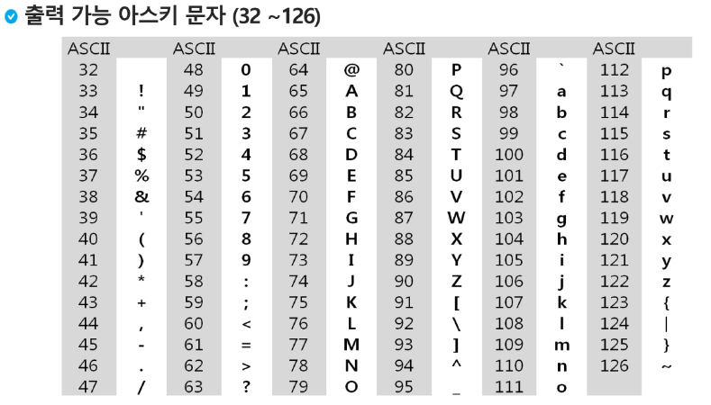
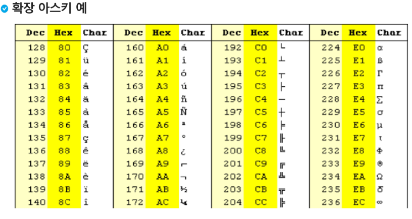
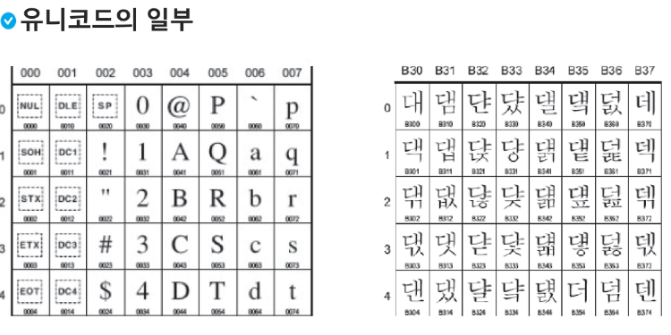
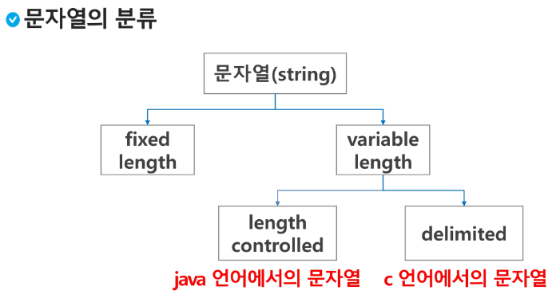
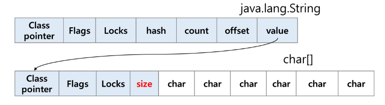
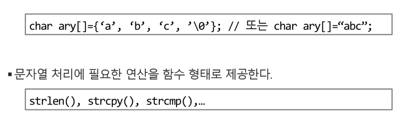
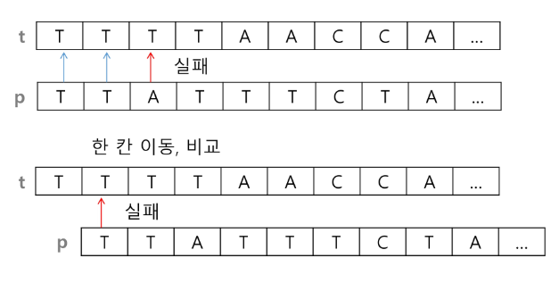
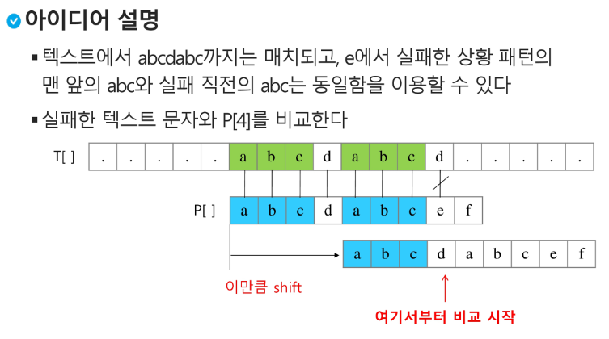
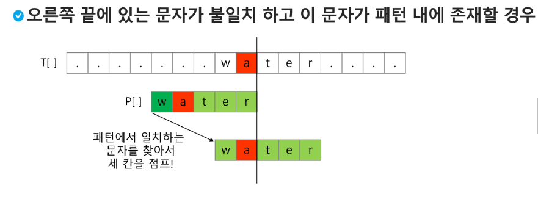

# 알고리즘 _String

## 문자열(String)

### 문자의 표현
- 컴퓨터에서의 문자 표현   
  - 글자 A를 메모리에 저장하는 방법에 대해서 생각해보자
  - 메모리는 숫자만 저장할 수 있기 때문에 각 문자에 대응되는 숫자를 정해 놓고 이것을 메모리에 저장하는 방법이 사용 됨.
  - 영어가 대소문자 합쳐서 52 이므로 6비트면 모두 표현할 수 있다.
  - 이를 코드체계라 한다. >> 000000 > a 000001 > b
- 네트워크가 발전하면서 정보를 달리 해석한다는 문제가 생겼다.
- 혼동을 피하기 위해 표준안을 만듬
- ASCII 라는 문자 인코딩 표준이 제정되었음
- ASCII는 7bit 인코딩으로 128문자를 표현하여 33개의 출력 불가능한 제어 문자들과 공백을 비롯한 95개의 출력 가능한 문자로 이루어짐.

- 확장 아스키는 표준 문자 이외의 악센트 문자, 도형 문자, 특수 문자, 특수 기호 등 부가적인 문자를 128개 추가할 수 있게 하는 부호이다.
  - 표준 아스키는 7bit를 사용하여 문자를 표현하는 데 비해 확장 아스키는 1B 이내의 8bit를 모두 사용함으로써 추가적인 문자를 표현 할 수 있다.
  - 컴퓨터 생산자와 소프트웨어 개발자가 여러 가지 다양한 문자에 할당할 수 있도록 하고 있다. 이렇게 할당된 확장 부호는 표준 아스키와 같이 서로 다른 프로그램이나 컴퓨터 사이에 교환되지 못한다.
  - 표준 아스키 : 마이크로 컴퓨터 하드웨어 및 소프트웨어 사이에서 세계적으로 통용 / 확장 아스키 : 프로그램이나 컴퓨터 또는 프린터가 그것을 해독할 수 있도록 설계해야만 해독 가능

- 오늘날 대부분의 컴퓨터는 문자를 읽고 쓰는데 ASCII형식을 사용한다
- 각 국가들은 자국의 문자를 표현하기 위하여 코드체계를 만들어 사용하게 됨.
- 자국의 코드체계를 타 국가가 가지고 있지 않으면 정보를 잘못 해석하게 됨
- 그래서 다국어 처리를 위해서 **유니코드 라는 표준을 마련**

- 유니코드도 다시 Character Set으로 분류된다.
  - USC-2(Universal Character Set 2)
  - USC-4(Universal Character Set 4)
  - 유니코드를 저장하는 변수의 크기를 정의
  - 그러나, 바이트 순서에 대해서 표준화 하지 못함
  - 파일을 인식 시 USC-2인지, 4인지 인식하고 각 경우를 구분해서 구현해야 하는 문제 발생
  - 그래서 **유니코드의 적당한 외부 인코딩 필요**

- 유니코드 인코딩 (UTF : Unicode Transformation Format)
- UTF-8(in web)
  - Min : 8bit, max : 32bit(1Byte*4)
- UTF-16(in windows, java)
  - Min : 15bit, max : 32bit(2Byte*2)
- UTF-32(in unix)
  - Min : 32bit, max : 32bit(4Byte*1)

### 문자열
- 문자열의 분류
- 

- java에서 String 클래스에 대한 메모리 배치 예
- 그림에서 보이듯, java.lang.String 클래스에는 기본적인 객체 메타 데이터 외에도 네 가지 필드들이 포함되어 있는데, hash값(hash), 문자열 길이(count), 문자열 데이터의 시작점(offset), 그리고 실제 문자열 배열에 대한 참조(value)이다.

- C언어에서 문자열 처리
  - 문자열은 문자들의 배열 형태로 구현된 응용 자료형
  - 문자배열에 문자열을 저장할 때는 항상 마지막에 끝을 표시하는 널문자(\0)를 넣어줘야 한다

[참고]
다음 두 코드의 차이 이해하기
~~~python
s1 = list(input())
s2 = input()
~~~
Strlen()함수 만들어보기
~~~python
def strlen(a) : 
    while a[i] != '\0':
        i += 1
    return i
# '\0'을 만나면 '\0'을 제외한 글자수를 리턴
# while 사용
~~~

#### Java(객체 지향 언어)에서의 문자열 처리
  - 문자열 데이터를 저장, 처리해주는 클래스를 제공한다.
  - String 클래스를 사용한다.
`String str = 'abc' // String str = new String('abc')`

  - 문자열 처리에 필요한 연산을 연산자, 메소드 형태로 제공한다.
  - +,length(),replace(),split(),substring()등

#### Python에서의 문자열 처리
- char 타입 없음
- 텍스트 데이터의 취급방법이 통일되어 있음

- 문자열 기호
  - '',"",''',"""
  - + 연결 (문자열+문자열)
  - * 반복 (문자열*수 : 수만큼 문자열 반복)
  - 
- 문자열은 시퀀스 자료형으로 분류되고, 시퀀스 자료형에서 사용할 수 있는 인덱싱, 슬라이싱 연산들을 사용할 수 있음
- 문자열 클래스에서 제공되는 메소드 : replace(), split(), isalpha(), find()
- 문자열은 튜플과 같이 요소값을 변경 할 수 없음(immutable)

#### C와 Java의 String 처리의 기본적인 차이점
- C는 아스키 코드로 저장한다.
- java는 유니코드(UTF16,2byte)로 저장한다
- 파이썬은 유니코드(UTF8) 로 저장

#### 문자열 뒤집기
- 자기 문자열에서 뒤집는 방법이 있고 새로운 빈 문자열을 만들어 소스의 뒤에서부터 읽어서 타겟에 쓰는 방법이 있겠다.
- 자기 문자열을 이용할 경우 swap을 위한 임시 변수가 필요하며 반복 수행을 문자열 길이의 반만을 수행해야 한다.

ex)
~~~python
s = 'Reverse this shtrings'
s = s[::-1]
s = 'abcd'
s = list(s)
s.reverse()
s - ''.join(s)
# for 문으로 구현해보기
~~~
- 파이썬에서는 == 연산자와 is 연산자를 제공한다.
  - == 연산자는 내부적으로 특수 메서드 __eq__()를 호출
ex)
~~~python
s1 = 'abc'
s2 = 'abc'
s3 = 'def'
s4 = s1
s5 = s1[:2] + 'c'

print(s1 == s2) # True
print(s1 is s2) # True
print(s1 == s5) # True
print(s1 is s5) # False(슬라이싱 이후에는 깊은 복사가 이루어짐, 다른 영역이 되어버림 == 연산자는 내용물을 비교 is 는 같은 애를 가르키는지 비교)
print(s5) # abc
~~~
- 파이썬에서는 숫자와 문자변환 함수를 제공한다.
  - ex) int, float, str, repr 

ex) int()와 같은 atoi() 함수만들기
~~~python
'''
s = '123'
a = atoi(s)
print(a+1)
'''
def atoi(s):
  i = 0 
  for x in s:
    i = i*10 + ord(x) - ord('0')
~~~

### 패턴 매칭
- 패턴 매칭에 사용되는 알고리즘들
  - 고지식한 패턴 검색 알고리즘
  - 카프-라빈 알고리즘
  - KMP 알고리즘
  - 보이어-무어 알고리즘

### 고지식한 알고리즘(Brute Force)
  - 본문 문자열을 처음부터 끝까지 차례대로 순회하면서 패턴 내의 문자들을 일일이 비교하는 방식으로 동작
  

~~~python
p = 'is' # 찾을 패턴
t = "This is a book~!" # 전체 텍스트
M = len(p) # 찾을 패턴의 길이
N = len(t) # 전체 텍스트의 길이

def BruteForce(p,t):
  i = 0 # t의 인덱스
  j = 0 # p의 인덱스 
  while j < M and i < N :
    if t[i] ! = p[j] :
      i = i - j 
      j = -1
    i = i + 1
    j = j + 1
    '''
    if t[i] == p[j]:
      i += 1
      j += 1
    else: 
      i = i -j +1
      j = 0
    '''
  if j == M : return i - M # 검색 성공
    else : return -1 # 검색 실패
~~~
- 고지식한 패턴 검색 알고리즘의 시간 복잡도 
  - 최악의 경우 시간 복잡도는 텍스트의 모든 위치에서 패턴을 비교해야 하므로 O(MN)이 됨
  - 길이가 10000인 문자열에서 길이 80인 패턴을 찾는다고 할 때, 최악의 경우 약 10000*80 = 800,000 번의 비교가 일어난다.

### KMP 알고리즘
- 불일치가 발생한 텍스트 스트링의 앞 부분에서 어떤 문자가 있는지를 미리 알고 있으므로, 불일치가 발생한 앞 부분에 대하여 다시 비교하지 않고 매칭을 수행
- 패턴을 전처리하여 배열 next[M]을 구해서 잘못된 시작을 최소화 함
  - next[M] : 불일치가 발생했을 경우 이동할 다음 위치
- 시간 복잡도 : O(M+N)

### 보이어-무어 알고리즘
- 오른쪽에서 왼쪽으로 비교
- 대부분의 상용 소프트웨어에서 채택하고 있는 알고리즘
- 보이어-무어 알고리즘은 패턴에 오른쪽 끝에 있는 문자가 불일치 하고 이 문자가 패턴 내에 존재하지 않는 경우, 이동 거리는 무려 패턴의 길이만큼이 된다

- 앞의 두 매칭 알고리즘들의 공통점 텍스트 문자열의 문자를 적어도 한번씩 훑는다는 것이다. 따라서 최선의 경우에도 오메가(n)
- 보이어-무어 알고리즘은 텍스트 문자를 다 보지 않아도 된다
- 발상의 전환 : 패턴의 오른쪽부터 비교한다
- 최악의 경우 수행시간 : ∂(mn)
- 입력에 따라 다르지만 일반적으로 시간이 덜든다.

### 문자열 암호화
#### 시저 암호
  - 줄리어스 시저가 사용했다고 하는 암호이다.
- 키값을 정해 더해서 암호를 만듬

#### 문자 변환표를 이용한 암호화(단일 치환 암호)
- 문자 변환표를 만들어서 암호화, 카이사르 암호화보다 훨씬 강력한 암호화 기법
- 단일 치환 암호의 복호화
  - 복호화 하기 위해서는 모든 키의 조합(Key space)가 필요하다.
- 단일 치환 암호의 키의 총수는 : 26!
- 비트연산 암호화
 
### 문자열 압축
- 저장소의 크기를 줄이며 정확한 정보를 저장하는 방법은?
  - Run-length encoding 알고리즘
  - 같은 값이 몇 번 반복되는가를 나타냄으로 압축
  - 이 방법은 이미지 파일포맷 중 BMP 파일포맷의 압축 방법이다.
  - 좀 더 효율적이고 일반적인 압축방법은 없는가?
    - 허프만 코딩 알고리즘
