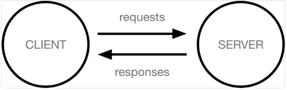

## Django

### Django 시작하기

#### Framework 이해하기
- 누군가 만들어 놓은 코드를 재사용 하는 것은 이미 익숙한 개발 문화
- 그렇다면 '웹서비스'도 누군가 개발해 놓은 코드를 재사용하면 된다.
- 전 세계의 수 많은 개발자들이 이미 수없이 많이 개발해 봤고, 그 과정에서 자주 사용되는 부분들을 재사용 할 수 있게 좋은 구조의 코드로 만들어 두었음
- 그러한 코드들을 모아 놓은 것, **즉 서비스 개발에 필요한 기능들을 미리 구현해서 모아 놓는 것 = Framwork**
- Frame(뼈대, 틀) + Work(일하다)
  - 일정한 뼈대, 틀을 가지고 일하다.
  - 제공받은 도구들과 뼈대, 규약을 가지고 무언가를 만드는 일
  - 특정 프로그램을 개발하기 위한 여러 도구들과 규약을 제공하는 것
- "소프트웨어 프레임워크"는 복잡한 문제를 해결하거나 서술하는 데 사용되는 기본 개념 구조

- 따라서, Framework를 잘 사용하기만 하면 웹 서비스 개발에 있어서 모든 것들을 하나부터 열까지 직접 개발할 필요 없이, 내가 만들고자 하는 본질(로직)에 집중해 개발할 수 있음
- 소프트웨어의 생산성과 품질을 높임
  
- Django를 배워야하는 이유
1. Python으로 작성된 프레임워크
   - Python이라는 언어의 강력함과 거대한 커뮤니티
2. 수많은 여러 유용한 기능들
3. 검증된 웹 프레임워크 
  - 화해, Toss, 두나무, 당근 마켓, 요기요 등
  - 유명한 많은 서비스들이 사용한다는 것 == 안정적으로 서비스를 할 수 있다는 검증

### 클라이언트와 서버
- 클라이언트 - 서버 구조
  - 오늘날 우리가 사용하는 대부분의 웹 서비스는 **클라이언트-서버 구조**를 기반으로 동작
  - **클라이언트**와 **서버** 역시 하나의 컴퓨터이며 이들이 어떻게 상호작용하는지에 대한 간소화된 다이어그램은 다음과 같음

#### 클라이언트
- 웹 사용자의 인터넷에 연결된 장치(예를들어 wi-fi에 연결된 컴퓨터 또는 모바일)
- Chrome 또는 Firefox와 같은 웹 브라우저
- 서비스를 요청하는 주체

#### 서버
- 웹페이지, 사이트 또는 앱을 저장하는 컴퓨터
- 클라이언트가 웹 페이지에 접근하려고 할 때 서버에서 클라이언트 컴퓨터로 웹 페이지 데이터를 응답해 사용자의 웹 브라우저에 표시됨
- 요청에 대해 서비스를 응답하는 주체

#### 상호작용 예시
- 예를들어, 우리가 Google 홈페이지에 접속한다는 것은 무엇을 뜻하는지 알아보자
1. 결론적으로 인터넷에 연결된 전세계 어딘가에 있는 구글 컴퓨터에게 'Google 홈페이지.html' 파일을 달라고 요청하는 것
2. 그러면 구글 컴퓨터는 우리의 요청을 받고 'Google 홈페이지.html' 파일을 인터넷을 통해서 우리 컴퓨터에게 응답해줌
3. 그렇게 전달받은 Google 홈페이지.html 파일을 웹 브라우저가 우리가 볼 수 있도록 해석해주는 것

#### 클라이언트-서버 구조
- 여기서 'Google 홈페이지.html'을 달라고 요청한 컴퓨터, 웹 브라우저를 **클라이언트** 라고 하고 'Google 홈페이지.html'파일을 제공한 컴퓨터, 프로그램을 **서버** 라고 함
- 어떠한 자원(resource)를 달라고 요청(request)하는 쪽을 클라이언트라고 하고 자원을 제공해주는 쪽을 서버(server)라고 함
#### 정리
- 앞으로 사용하는 웹은 클라이언트-서버 구조로 이루어져 있음
- 앞으로 우리가 배우는 것도 이 클라이언트-서버 구조를 만드는 방법을 배우는 것
- 이 중에서 Django는 서버를 구현하는 웹 프레임 워크

### 가상환경
- 패키지와 가상환경
  - 이제부터 정말 많은 외부 패키지를 가져다 사용할 수 있다.
  - 그런데 만약 각각의 패키지를 하나의 환경에 담아야 한다면?

#### 가상환경 사용하기
- 가상환경 생성
  - python -m venv venv
- 가상환경 활성화(ON)
  - source venv/Scripts/activate
- 가상환경 비활성화(OFF)
  - deactivate

- 가상환경은 프로젝트별 패키지를 독립적으로 관리하기 위한 것
- 내 프로젝트를 다른 사람이 실행하려면?
  - 모든 패키지를 다 설치해야 한다!
- 가상환경 패키지 목록 저장
  - pip freeze > requirements.txt
- 파일로부터 패키지 설치
  - pip install -r requirements.txt
- 