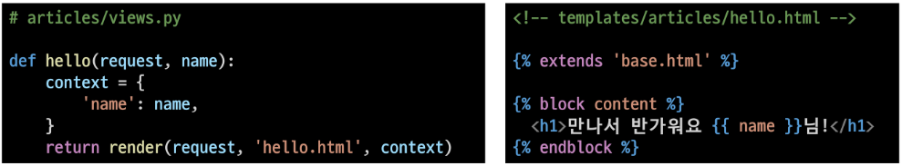

## Django

### Django 시작하기

#### Framework 이해하기

-   누군가 만들어 놓은 코드를 재사용 하는 것은 이미 익숙한 개발 문화
-   그렇다면 '웹서비스'도 누군가 개발해 놓은 코드를 재사용하면 된다.
-   전 세계의 수 많은 개발자들이 이미 수없이 많이 개발해 봤고, 그 과정에서 자주 사용되는 부분들을 재사용 할 수 있게 좋은 구조의 코드로 만들어 두었음
-   그러한 코드들을 모아 놓은 것, **즉 서비스 개발에 필요한 기능들을 미리 구현해서 모아 놓는 것 = Framwork**
-   Frame(뼈대, 틀) + Work(일하다)
    -   일정한 뼈대, 틀을 가지고 일하다.
    -   제공받은 도구들과 뼈대, 규약을 가지고 무언가를 만드는 일
    -   특정 프로그램을 개발하기 위한 여러 도구들과 규약을 제공하는 것
-   "소프트웨어 프레임워크"는 복잡한 문제를 해결하거나 서술하는 데 사용되는 기본 개념 구조

-   따라서, Framework를 잘 사용하기만 하면 웹 서비스 개발에 있어서 모든 것들을 하나부터 열까지 직접 개발할 필요 없이, 내가 만들고자 하는 본질(로직)에 집중해 개발할 수 있음
-   소프트웨어의 생산성과 품질을 높임
-   Django를 배워야하는 이유

1. Python으로 작성된 프레임워크
    - Python이라는 언어의 강력함과 거대한 커뮤니티
2. 수많은 여러 유용한 기능들
3. 검증된 웹 프레임워크

-   화해, Toss, 두나무, 당근 마켓, 요기요 등
-   유명한 많은 서비스들이 사용한다는 것 == 안정적으로 서비스를 할 수 있다는 검증

### 클라이언트와 서버

-   클라이언트 - 서버 구조
    -   오늘날 우리가 사용하는 대부분의 웹 서비스는 **클라이언트-서버 구조**를 기반으로 동작
    -   **클라이언트**와 **서버** 역시 하나의 컴퓨터이며 이들이 어떻게 상호작용하는지에 대한 간소화된 다이어그램은 다음과 같음

#### 클라이언트

-   웹 사용자의 인터넷에 연결된 장치(예를들어 wi-fi에 연결된 컴퓨터 또는 모바일)
-   Chrome 또는 Firefox와 같은 웹 브라우저
-   서비스를 요청하는 주체

#### 서버

-   웹페이지, 사이트 또는 앱을 저장하는 컴퓨터
-   클라이언트가 웹 페이지에 접근하려고 할 때 서버에서 클라이언트 컴퓨터로 웹 페이지 데이터를 응답해 사용자의 웹 브라우저에 표시됨
-   요청에 대해 서비스를 응답하는 주체

#### 상호작용 예시

-   예를들어, 우리가 Google 홈페이지에 접속한다는 것은 무엇을 뜻하는지 알아보자

1. 결론적으로 인터넷에 연결된 전세계 어딘가에 있는 구글 컴퓨터에게 'Google 홈페이지.html' 파일을 달라고 요청하는 것
2. 그러면 구글 컴퓨터는 우리의 요청을 받고 'Google 홈페이지.html' 파일을 인터넷을 통해서 우리 컴퓨터에게 응답해줌
3. 그렇게 전달받은 Google 홈페이지.html 파일을 웹 브라우저가 우리가 볼 수 있도록 해석해주는 것

#### 클라이언트-서버 구조

-   여기서 'Google 홈페이지.html'을 달라고 요청한 컴퓨터, 웹 브라우저를 **클라이언트** 라고 하고 'Google 홈페이지.html'파일을 제공한 컴퓨터, 프로그램을 **서버** 라고 함
-   어떠한 자원(resource)를 달라고 요청(request)하는 쪽을 클라이언트라고 하고 자원을 제공해주는 쪽을 서버(server)라고 함

#### 정리

-   앞으로 사용하는 웹은 클라이언트-서버 구조로 이루어져 있음
-   앞으로 우리가 배우는 것도 이 클라이언트-서버 구조를 만드는 방법을 배우는 것
-   이 중에서 Django는 서버를 구현하는 웹 프레임 워크

### Django

-   Django 설치
    -   pip install django==3.2.18
-   프로젝트 생성
    -   django-admin startproject firstpjt
-   서버 실행
    -   python manage.py runserver

### 가상환경

-   패키지와 가상환경
    -   이제부터 정말 많은 외부 패키지를 가져다 사용할 수 있다.
    -   그런데 만약 각각의 패키지를 하나의 환경에 담아야 한다면?

#### 가상환경 사용하기

-   가상환경 생성
    -   python -m venv venv
-   가상환경 활성화(ON)
    -   source venv/Scripts/activate
-   가상환경 비활성화(OFF)
    -   deactivate

-   가상환경은 프로젝트별 패키지를 독립적으로 관리하기 위한 것
-   내 프로젝트를 다른 사람이 실행하려면?
    -   모든 패키지를 다 설치해야 한다!
-   가상환경 패키지 목록 저장
    -   pip freeze > requirements.txt
-   파일로부터 패키지 설치
    -   pip install -r requirements.txt

### 프로젝트와 앱

#### 프로젝트 구조

-   **init**.py
    -   python에게 이 디렉토리를 하나의 Python 패키지로 다루도록 지시
    -   별도로 추가 코드를 작성하지 않음
-   asgi.py
    -   Asynchronous Server Gateway Interface
    -   Django 애플리케이션이 비동기식 웹 서버와 연결 및 소통하는 것을 도움
    -   추후 배포 시에 사용하며 지금은 수정하지 않음
-   settings.py
    -   Django 프로젝트 설정을 관리
-   urls.py
    -   사이트의 url과 적절한 views의 연결을 지정
-   wsgi.py
    -   Web Server Gateway Interface
    -   Django 애플리케이션이 웹서버와 연결 및 소통하는 것을 도움
    -   추후 배포시에 사용하며 지금은 수정하지 않음
-   manage.py
    -   Django 프로젝트와 다양한 방법으로 상호작용하는 커맨드라인 유틸리티

#### Django Application

-   애플리케이션(앱)생성

    -   python manage.py startapp articles
        (일반적으로 애플리케이션 이름은 '복수형'으로 작성하는 것을 권장)

-   앱(App) == 하나의 큰 기능 단위
-   정해진 규칙은 없으며 개발자가 판단해서 앱 생성
-   여러개의 앱이 아닌 단일 앱으로 개발해도 괜찮음

#### 애플리케이션 구조

-   admin.py
    -   관리자용 페이지를 설정하는 곳
-   apps.py
    -   앱의 정보가 작성된 곳
    -   별도의 추가 코드를 작성하지 않음
-   models.py
    -   애플리케이션에서 사용하는 Model을 정의하는 곳
    -   MTV 패턴의 M에 해당
-   tests.py
    -   프로젝트의 테스트 코드를 작성하는 곳
-   views.py
    -   view 함수들이 정이 되는 곳
    -   MTV 패턴의 V에 해당

#### 애플리케이션 등록

-   앱을 사용하기 위해서는 반드시 INSTALLED_APPS 리스트에 반드시 추가해야 함

#### Project & Application

-   Project
    -   "collection of apps"
    -   프로젝트는 앱의 집합
    -   프로젝트에는 여러 앱이 포함될 수 있음
    -   앱은 여러 프로젝트에 있을 수 있음
-   Application
    -   앱은 실제 요청을 처리하고 페이지를 보여주는 등의 역할을 담당
    -   앱은 하나의 역할 및 기능 단위로 작성하는 것을 권장함

### 요청과 응답

-   Django의 세가지 구조
-   Model - view - template

-   URL - VIEW - TEMPLATE 데이터 흐름 이해하기

#### URLs

-   URL-VIEW-TEMPLATE 기초 과정을 작성해보고 데이터의 흐름을 이해하기

#### View

#### Templates

#### render

-   `render(request, template_name, context)`
-   주어진 템플릿을 주어진 컨텍스트 데이터와 결합하고 렌더링 된 텍스트와 함께 HttpResponse(응답) 객체를 반환하는 함수
    1. request
    -   응답을 생성하는 데 사용되는 요청 객체
    2. template_name
    -   템플릿의 전체 이름 또는 템플릿 이름의 경로
    3. context
    -   템플릿에서 사용할 데이터 (딕셔너리 타입으로 작성)

### 코드 작성 순서

-   앞으로 Django에서의 코드 작성은 URL -> View -> Template 순으로 작성

### MTV Design Pattern

#### Design Pattern 이란?

-   자주 사용되는 구조가 있다는 것을 알게 되었고 이를 일반화해서 하나의 공법으로 만들어 둔 것
-   소프트웨어에서의 관점
    -   각기 다른 기능을 가진 다양한 응용 소프트웨어를 개발할 때 공통적인 설계 문제가 존재하며, 이를 처리하는 해결책 사이에도 공통점이 있다는 것을 발견
    -   이러한 유사점을 패턴이라 함

#### 소프트웨어 디자인 패턴

-   소프트웨어에도 수십년간 전 세계의 개발자들이 계속 만들다 보니 자주 사용되는 구조와 해결책이 있다는 것을 알게 됨
-   앞서 배웠던 클라이언트-서버 구조도 소프트웨어 디자인 패턴 중 하나
-   자주 사용되는 소프트웨어의 구조를 소수의 뛰어난 엔지니어가 마치 건축의 공법처럼 일반적인 구조화를 해둔 것

#### 소프트웨어 디자인 패턴의 목적

-   특정 문맥에서 공통적으로 발생하는 문제에 대해 재사용이 가능한 해결책을 제시
-   프로그래머가 어플리케이션이나 시스템을 디자인할 때 발생하는 공통된 문제들을 해결하는데 형식화 된 가장 좋은 관행

#### 소프트웨어 디자인 패턴의 장점

-   디자인 패턴을 알고 있다면 서로 복잡한 커뮤니케이션이 매우 간단해짐
-   다수의 엔지니어들이 일반화된 패턴으로 소프트웨어 개발을 할 수 있도록 한 규칙, 커뮤니케이션의 효율성을 높이는 기법

### Django's Design Pattern

-   Django에서의 디자인 패턴
    -   Django에도 이러한 디자인 패턴이 적용이 되어 있는데, Django에 적용된 디자인 패턴은 MTV 패턴이다.
    -   MTV 패턴은 MVC 디자인 패턴을 기반으로 조금 변형된 패턴이다.
-   MVC 소프트웨어 디자인 패턴

    -   MVC 는 Model - View - Controller의 준말
    -   데이터 및 논리 제어를 구현하는데 널리 사용되는 소프트웨어 디자인 패턴
    -   하나의 큰 프로그램을 세가지 역할로 구분한 개발 방법론

    1. Model : 데이터와 관련된 로직을 관리
    2. View : 레이아웃과 화면을 처리
    3. Controller : 명령을 model과 view부분으로 연결

-   MVC 소프트웨어 디자인 패턴의 목적

    -   관심사 분리
    -   더 나은 업무의 분리와 향상된 관리를 제공
    -   각 부분을 독립적으로 개발할 수 있어, 하나를 수정하고 싶을 때 모두 건들지 않아도 됨
    -   개발 효율성 및 유지보수가 쉬워짐
    -   다수의 멤버로 개발하기 용이함

-   Django에서의 디자인 패턴
    -   Django는 MVC 패턴을 기반으로 한 MTV 패턴을 사용
    -   두 패턴은 서로 크게 다른 점은 없으며 일부 역할에 대해 부르는 이름이 다름

### MTV 디자인 패턴

#### Model

-   MVC 패턴에서 Model의 역할에 해당
-   데이터와 관련된 로직을 관리
-   응용프로그램의 데이터 구조를 정의하고 데이터베이스의 기록을 관리

#### Template

-   레이아웃과 화면을 처리
-   화면상의 사용자 인터페이스 구조와 레이아웃을 정의
-   MVC 패턴에서 View의 역할에 해당

#### View

-   Model & Template과 관련한 로직을 처리해서 응답을 반환
-   클라이언트의 요청에 대해 처리를 분기하는 역할
-   동작 예시
    -   데이터가 필요하다면 model에 접근해서 데이터를 가져오고 가져온 데이터를 template로 보내 화면을 구성하고 구성된 화면을 응답으로 만들어 클라이언트에게 반환
-   MVC 패턴에서 Controller의 역할에 해당

#### 정리

-   Django는 MTV 디자인 패턴을 가지고 있음
    -   Model : 데이터 관련
    -   Template : 화면 관련
    -   View : Model & Template 중간 처리 및 응답 반환

### Django Template

-   Django Template
    -   데이터 표현을 제어하는 도구이자 표현에 관련된 로직
    -   Django Template을 이용한 HTML 정적 부분과 동적 컨텐츠 삽입
    -   Template System의 기본 목표를 숙지
-   Django Template System
    -   데이터 표현을 제어하는 도구이자 표현에 관련된 로직을 담당

### Django Template Language(DTL)

-   Django template에서 사용하는 built-in template system
-   조건, 반복, 변수 치환, 필터 등의 기능을 제공
    -   Python처럼 일부 프로그래밍 구조(if, for 등)를 사용할 수 있지만 이것은 **Python 코드로 실행되는 것이 아님**
    -   Django 템플릿 시스템은 단순이 Python이 HTML에 포함 된 것이 아니니 주의
-   프로그래밍적 로직이 아니라 프레젠테이션을 포현하기 위한 것임을 명심할 것

### DTL Syntax

1. Variable
   `{{ variable }}`

-   변수명은 영어, 숫자와 밑줄(\_)의 조합으로 구성될 수 있으나 밑줄로는 시작할 수 없음, 공백이나 구두점 문자 또한 사용할 수 없음
-   dot(.)를 사용하여 변수 속성에 접근할 수 있음
-   render()의 세번째 인자로 {'key' : value} 와 같이 딕셔너리 형태로 넘겨주며, 여기서 정의한 key에 해당하는 문자열이 template에서 사용 가능한 변수명이 됨

2. Filters
   `{{ variable|filter}}`

-   표시할 변수를 수정할 때 사용
-   ex) name 변수를 모두 소문자로 출력 `{{name|lower}}`
-   60개의 built-in template filters를 제공
-   chained가 가능하며 일부 필터는 인자를 받기도 함 `{{ name|truncatewords:30}}`

3. Tags
   ``

-   출력 텍스트를 만들거나, 반복 또는 논리를 수행하여 제어 흐름을 만드는 등 변수보다 복잡한 일들을 수행
-   일부 태그는 시작과 종료 태그가 필요 ``
-   약 24개의 bulit-in template tags를 제공

4. comments
   `{# #}`

-   Django template에서 라인의 주석을 표현하기 위해 사용
-   아래처럼 유효하지 않은 템플릿 코드가 포함될 수 있음
-   한줄 주석에만 사용할 수 있음
-   여러줄 주석은  와  사이에 입력

### Template ingeritance

-   템플릿 상속
    -   템플릿 상속은 기본적으로 코드의 재사용성에 초점을 맞춤
    -   템플릿 상속을 사용하면 사이트의 모든 공통 요소를 포함하고, 하위 템플릿이 재정의(override) 할 수 있는 블록을 정의하는 기본 'skeleton' 템플릿을 만들 수 있음
-   만약 모든 템플릿에 부트스트랩을 적용하려면 어떻게 해야할까?
    -   모든 템플릿에 부트스트랩 CDN을 작성해야 할까?

#### 템플릿 상속에 관련된 태그

``

-   자식(하위) 템플릿이 부모 템플릿을 확장한다는 것을 알림
-   !반드시 템플릿 최상단에 작성 되어야 함(즉, 2개 이상 사용할 수 없음)
    ``
-   하위 템플릿에서 재지정(overridden)할 수 있는 블록을 정의
-   즉, 하위 템플릿이 채울 수 있는 공간
-   가독성을 높이기 위해 선택적으로 endblock 태그에 이름을 지정할 수 있음

### Django URLs

### Trailing Slashes

-   Django는 URL 끝에 /가(Trailing slash) 없다면 자동으로 붙여주는 것이 기본 설정
    -   그래서 모든 주소가 / 로 끝나도록 구성되어있음
    -   그러나 모든 프레임워크가 이렇게 작동하는 것은 아님
-   Django의 url 설계 철학을 통해 먼저 살펴보면 다음과 같이 설명함
-   기술적인 측면에서, foo.com/bar 와 foo.com/bar/는 서로 다른 URL이다
    -   검색 엔진 로봇이나 웹 트래픽 분석 도구에서는 그 둘을 서로 다른 페이지로 봄
    -   그래서 Django는 URL을 정규화하여 검색 엔진 로봇이 혼동하지 않게 해야 함

### Variable routing

-   필요성
    -   템플릿의 많은 부분이 중복되고, 일부분만 변겨오디는 상황에서 비슷한 URL과 템플릿을 계속해서 만들어야 할까?
-   URL 주소를 변수로 사용하는 것을 의미
-   URL의 일부를 변수로 지정하여 view 함수의 인자로 넘길 수 있음
-   즉, 변수 값에 따라 하나의 path()에 여러 페이지를 연결 시킬 수 있음

#### Variable routing 작성

-   변수는 <>에 정의하며 view 함수의 인자로 할당됨
-   기본 타입은 string이며 5가지 타입으로 명시할 수 있음

1. str
    - /을 제외하고 비어있지않은 모든 문자열
    - 작성하지 않은 겨웅 기본 값
2. int
    - 0 또는 양의 정수와 매치
3. slug
4. uuid
5. path

#### view 함수 작성

-   variable routing으로 할당된 변수를 인자로 받고 템플릿 변수로 사용할 수 있음
    

### App URL mapping

-   앱이 많아졌을 때 urls.py를 각 app에 매핑하는 방법
-   간단하다, urls.py를 쪼개면 된다.
-   하나의 프로젝트에 여러 앱이 존재한다면, 각각의 앱 안에 urls.py를 만들고 프로젝트 urls.py에서 각 앱의 urls.py 파일로 URL 매핑을 위탁할 수 있음
-   각각의 app 폴더 안에 urls.py를 작성

