## CSS

### CSS Box Model

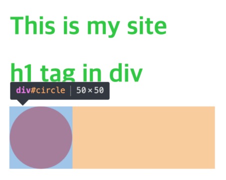

- 모든 요소는 네모(박스모델)이고, 위에서부터 아래로, 왼쪽에서 오른쪽으로 쌓인다.
- 모든 HTML 요소는 box 형태로 되어있음
- 하나의 박스는 네 부분(영역)으로 이루어짐
  - content
  - padding
  - border
  - margin

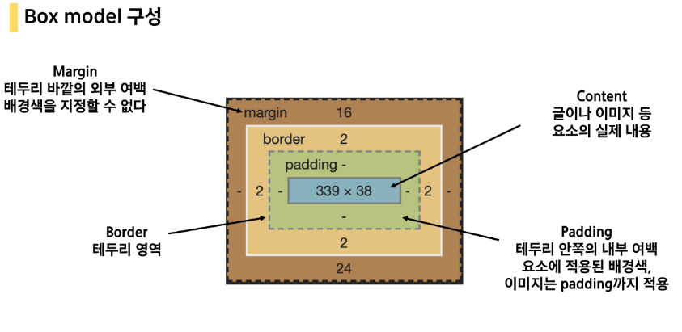

#### Box model 구성(margin) - 상하좌우
.margin{
    margin-top:10px;
    margin-right:20px;
    margin-bottom:30px;
    margin-left:40px;
}

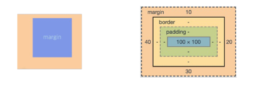

#### Box model 구성(padding) - 상하좌우
.margin-padding{
    margin:10px;
    padding:30px;
}

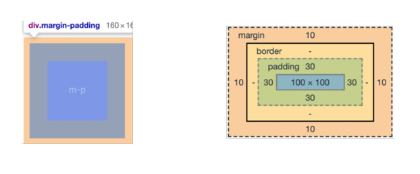

#### Box model 구성(border) -상하좌우
.border{
    border-width:2px;
    border-style:dashed;
    border-color:black;
}

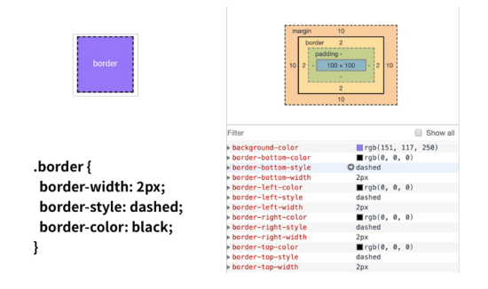

#### box-sizing
- 기본적으로 모든 요소의 box-sizing은 content-box
  - padding을 제외한 순수 contents 영역만을 box로 지정
- 다만, 우리가 일반적으로 영역을 볼 떄는 border까지의 너비를 100px 보는 것을 원함
  - 그 경우 box-sizing을 border-box으로 설정

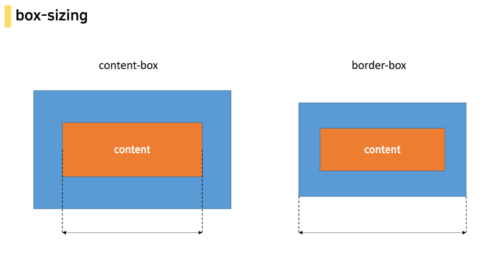

### 개발자 도구
- 웹 브라우저 크롬에서 제공하는 개발과 관련된 다양한 기능을 제공
- 주요 기능
  - Elements -DOM 탐색 및 CSS 확인 및 변경
  - Styles - 요소에 적용된 CSS 확인
  - Computed - 스타일이 계산된 최종 결과
  - Event Listeners - 해당 요소에 적용된 이벤트(JS)
- Sources, Network, Performance, Application, Security, Audits 등

#### HTML - elements
- elements : 해당 요소의 HTML 태그

#### HTML DOM 조작하기
- Element에서 HTML 태그 구조를 탐색하며 추가, 삭제, 이동, 편집 등이 가능

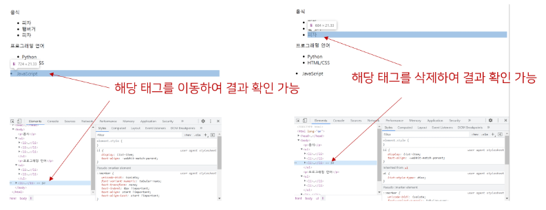
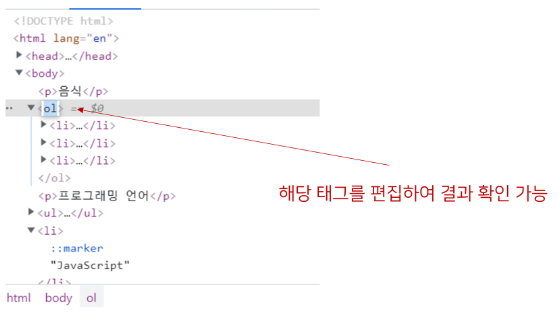

#### CSS - styles, computed
- styles : 해당 요소에 선언된 모든 CSS
- computed : 해당 요소에 최종 계산된 CSS

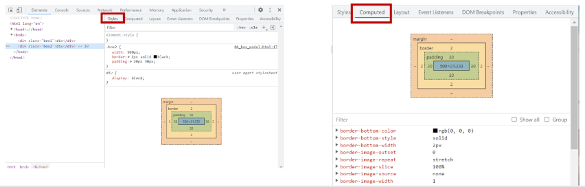

#### CSS 조작하기
- 우선순위, 파일 로딩 등에 의해 적용되고 있는 모든 CSS를 확인할 수 있음
- 원하는 속성을 제거해보거나, 값을 변경하여 결과를 바로 확인할 수 있음
- 박스 모델에 해당하는 영역 값을 쉽게 변경 할 수 있음
- 해당 요소에 대한 스타일을 다양하게 추가해 볼 수 있음
- 상속 관계도 확인 가능

### CSS Layout

### CSS Display
- 모든 요소는 네모(박스모델)이고, 좌측 상단에 배치
- display에 따라 크기와 배치가 달라진다.

#### 대표적으로 활용되는 display
- display: block
  - 줄 바꿈이 일어나는 요소 (다른 elem를 밀어낸다!)
  - 화면 크기 전체의 가로 폭을 차지한다.
  - 블록 레벨 요소 안에 인라인 레벨 요소가 들어갈 수 있음
- display: inline
  - 줄 바꿈이 일어나지 않는 행의 일부 요소
  - content를 마크업 하고 있는 만큼만 가로 폭을 차지한다.
  - width, height, margin-top, margin-bottom을 지정할 수 없다.
  - 상하 여백은 line-height로 지정한다.

#### 블록 레벨 요소와 인라인 레벨 요소
- 블록 레벨 요소와 인라인 레벨 요소 구분
- 대표적인 블록 레벨 요소
  - div/ ul,ol,li / p / hr / form 등
- 대표적인 인라인 레벨 요소
  - span / a / img / input,label / b, em, i, strong 등

#### block
- block의 기본 너비는 가질 수 있는 너비의 100%
- 너비를 가질 수 없다면 자동으로 부여되는 margin

#### inline
- inline의 기본 너비는 컨텐츠 영역만큼만

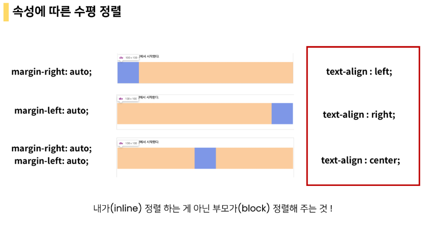

#### display
- display : inline-block
  - block과 inline 레벨 요소의 특징을 모두 가짐
  - inline처럼 한 줄에 표시 가능하고, block처럼 width, height, margin 속성을 모두 지정할 수 있음
- display : none
  - 해당 요소를 화면에 표시하지 않고, 공간조차 부여되지 않음
  - 이와 비슷한 visibility : hidden은 해당 요소가 공간을 차지하나 화면에 표시만 되지 않는다.

### CSS position

- 문서 상에서 요소의 위치를 지정(어떤 기준으로 어디에 배치시킬지)
- static : 모든 태그의 기본 값(기준 위치)
  - 일반적인 요소 배치 순서에 따름(좌측 상단)
  - 부모 요소 내에서 배치될 떄는 부모 요소의 위치를 기준으로 배치 됨
- 아래는 좌표 프로퍼티(top,bottom,left,right)를 사용하여 이동 가능
  - relative : 상대위치
    - 자기 자신의 static 위치를 기준으로 이동(normal flow 유지)
    - 레이아웃에서 요소가 차지하는 공간은 static 일 떄와 같음(normal position 대비 offset)
  - absolute : 절대 위치
    - 요소를 일반적인 문서 흐름에서 제거 후 레이아웃에 공간을 차지하지 않음(normal flow에서 벗어남)
    - static이 아닌 가장 가까이 있는 부모/조상 요소를 기준으로 이동(없는 경우 body)
  - fixed : 고정 위치
    - 요소를 일반적인 문서 흐름에서 제거 후 레이아웃에 공간을 찾이하지 않음(normal flow에서 벗어남)
    - 부모 요소와 관계없이 viewprot를 기준으로 이동
      - 스크롤 시에도 항상 같은 곳에 위치함
  - sticky : 스크롤에 따라 static -> fixed로 변경
    - 속성에 적용한 박스는 평소에 문서 안에서 position : static 상태와 같이 일반적인 흐름에 따르지만 스크롤 위치가 임계점에 이르면 postion:fixed와 같이 박스를 화면에 고정할 수 있는 속성

- CSS 원칙 3가지
  - 모든 요소는 네모(박스모델), 좌측 상단에 배치
  - display에 따라 크기와 배치가 달라짐
  - position으로 위치의 기준을 변경
    - relative : 본인의 원래 위치
    - absolute : 특정 부모의 위치
    - fixed : 화면의 위치

## CSS Layout
### Float
- CSS 원칙
  - 모든 요소는 네모(박스모델)이고, 위에서부터 아래로, 왼쪽에서 오른쪽으로 쌓인다.(좌측 상단에 배치)
#### Float
- 박스를 왼쪽 혹은 오른쪽으로 이동시켜 텍스트를 포함 인라인요소들이 주변을 wrapping 하도록 함
- 요소가 Normal flow를 벗어나도록 함
#### Float 속성
- none : 기본값
- left : 요소를 왼쪽으로 띄움
- right : 요소를 오른쪽으로 띄움

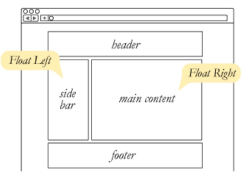

#### Float 정리
- Float는 레이아웃을 구성하기 위해 필수적으로 활용 되었으나, 최근 Flexbox, Grid 등장과 함께 사용도가 낮아짐
- Float 활용 전략 - Normal Flow에서 벗어난 레이아웃 구성
  - 원하는 요소들을 Float로 지정하여 배치

### Flexbox
- Latout을 위해 탄생한 Flexbox
  - Float & inline-block 등을 이용한 Layout은 솔직히 사용하기 쉽지 않음
  - Layout에 특화된 기능을 만들면 어떨까?
- CSS Flexible Box Layout
  - 행과 열 형태로 아이템들을 배치하는 1차원 레이아웃 모델
  - 축
    - main axis(메인 축)
    - cross axis(교차 축)
  - 구성요소
    - Flex Container(부모 요소)
      - 컨테이너 안에 아이템이 담겨있다! 컨테이너를 조작해서 배치하기
    - Flex Item(자식 요소)
  
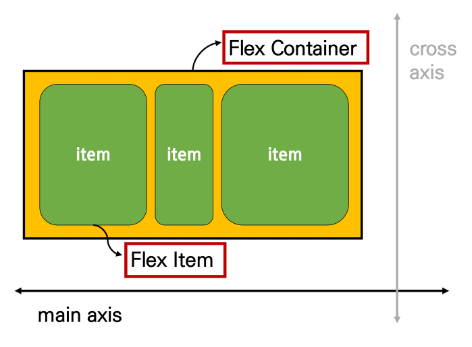

#### Flexbox 축
- flex-direction : row 

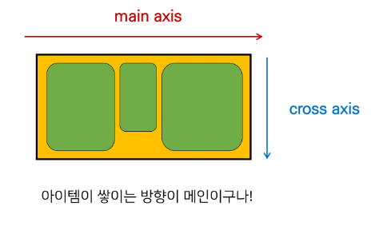

#### FLexbox 구성 요소
- Flex Container(부모 요소)
  - Flexbox 레이아웃을 형성하는 가장 기본적인 모델
  - Flex Item들이 놓여있는 영역
  - display 속성을 flex 혹은 inline-flex로 지정
- Flex Item(자식 요소)
  - 컨테이너에 속해 있는 컨텐츠(박스)

#### Flexbox 시작
- Flexbox의 속성은 컨테이너에 적용하는 속성과 아이템에 적용하는 속성으로 나뉜다.

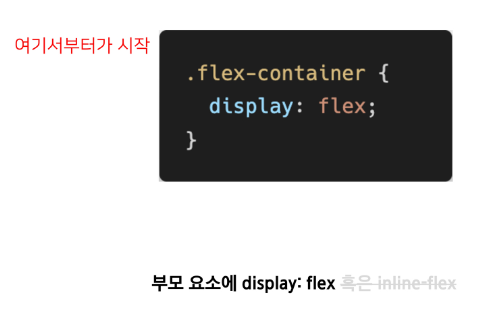

- 부모 요소에 display:flex
- 컨테이너 안에 아이템들이 배치되는데 주축을 기준으로 배치되며 각각의 아이템들은 내용물의 width를 갖도록, 아이템들의 height는 컨테이너와 같도록 조정된다.
- 만약 각각의 아이템이 저마다의 높이를 가지고 있다면, flex는 자동으로 맞춰준다. 즉 Layout 배치가 매우 쉬워진다.

#### FLex 속성
- 배치 설정
  - flex-direction
  - flex-wrap
- 공간 나누기
  - justify-content(main axis)
  - align-content(cross axis)
- 정렬
  - align-items(모든 아이템을 cross axis 기준으로)
  - align-self(개별 아이템)
#### Flex 속성 : flex-direction
- Main axis 기준 방향 설정
- 역방향의 경우 HTML 태그 선언 순서와 시각적으로 다르니 유의

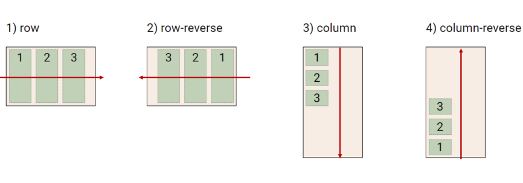

#### Flex 속성 : flex-wrap
- 아이템이 컨테이너를 벗어나는 경우 해당 영역 내에 배치되도록 설정
- 즉, 기본적으로 컨테이너 영역을 벗어나지 않도록 함

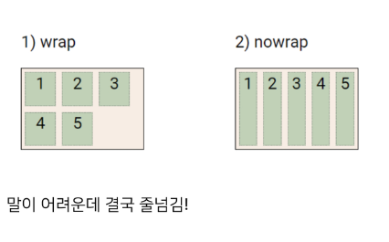

#### Flex 속성 : flex-direction & flex-wrap
- flex-direction : Main axis의 방향을 설정
- flex-wrap : 요소들이 강제로 한 줄에 배치 되게 할 것인지 여부 설정
  - nowrap(기본값) : 한 줄에 배치
  - wrap : 넘치면 그 다음 줄로 배치
- flex-flow
  - flex-direction 과 flex-wrap의 shorthand
  - flrx-direction 과 flex-wrap에 대한 설정 값을 차례로 작성
  - 예시) flex-flow : row nowrap;

#### Flex 속성 : justify-content
- Main axis를 기준으로 공간 배분

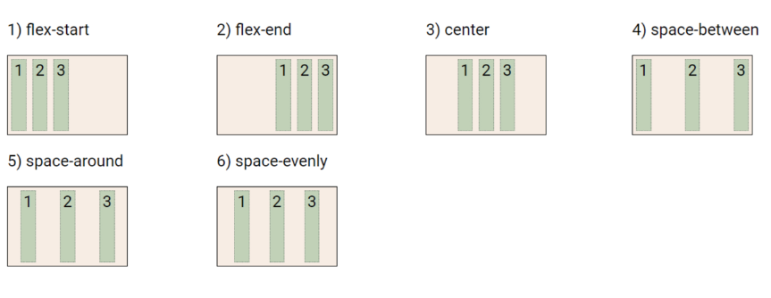

#### Flex 속성 : align-content
- Cross axis를 기준으로 공간 배분(아이템이 한 줄로 배치되는 경우 확인할 수 없음)

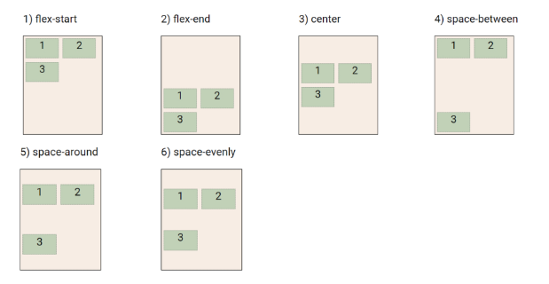

#### Flex 속성 : justify-content & align-content
- 공간 배분
  - flex-start(기본 값) : 아이템들이 axis 시작점으로
  - flex-end : 아이템들을 axis 끝 쪽으로
  - center : 아이템들을 axis 중앙으로
  - space-between : 아이템 사이의 간격을 균일하게 분배
  - space-around : 아이템을 둘러싼 영역을 균일하게 분배(가질 수 있는 영역을 반으로 나눠서 양쪽에)
  - space-evenly : 전체 영역에서 아이템 간 간격을 균일하게 분배
