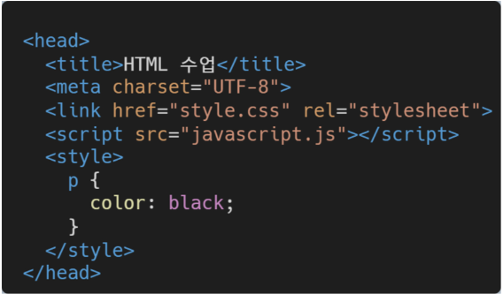

## HTML
### INTRO
- 웹 사이트는 웹 페이지의 모음
- `웹 사이트`란 웹 브라우저를 통해서 접속하는 웹 페이지들의 모음!
- 웹 페이지는 글, 그림, 동영상 등 여러가지 정보를 담고 있으며, 링크를 통해 다른 웹 페이지로 이동이 가능함
- 즉, `링크를 통해 여러 웹 페이지를 연결한 것`이 웹 사이트
- MDL, w3schools 잘 사용해보기
- 

### HTML 이해하기
#### HTML : Hyper Text Markup Language
- Hyper Text
  - 참조(하이퍼링크)를 통해 사용자가 한 문서에서 다른 문서로 즉시 접근할 수 있는 텍스트
- Markup Language
  - 태그 등을 이용하여 문서나 데이터의 구조를 명시하는 언어
    - 대표적인 예 - HTML, Markdown
- 웹 페이지를 작성(구조화)하기 위한 언어

### HTML 기본구조
- html : 문서의 최상위(root) 요소
- head : 문서 메타데이터 요소
  - 문서 제목, 인코딩, 스타일, 외부 파일 로딩 등
  - 일반적으로 브라우저에 나타나지 않는 내용
- body : 문서 본문 요소
  - 실제 화면 구성과 관련된 내용

#### head
- <title> : 브라우저 상단 타이틀
- <link> : 외부 리소스 연결 요소(CSS파일 등)
- <style> : CSS 직접 작성

#### 요소(element)
- HTML의 요소는 태그와 내용(contents)으로 구성되어 있다.
  - 열었으면, 닫아야 한다.
  - 모든 내용은 태그로 감싸져 있어야 한다.

- HTML 요소는 시작 태그와 종료 태그 그리고 태그 사이에 위치한 내용으로 구성
  - 태그는 컨텐츠(내용)을 감싸는 것으로 그 정보의 성격과 의미를 정의
- 내용이 없는 태그들
  - br,hr,img,input,link,meta
- 요소는 중첩(nested) 될 수 있음
  - 요소의 중첩을 통해 하나의 문서를 구조화
  - 여는 태그와 닫는 태그의 쌍을 잘 확인해야함
    - 오류를 반환하는 것이 아닌 그냥 레이아웃이 깨진 상태로 출력되기 때문에, 디버깅이 힘들어 질 수 있음
#### 속성(attribute)
- 각 태그별로 사용할 수 있는 속성이 다르다.
- 속성은 속성명과 속성값을 이루어져 있다.
  

- 속성을 통해 태그의 부가적인 정보를 설정할 수 있음
- 요소는 속성을 가질 수 있으며, 경로나 크기와 같은 추가적인 정보를 제공
- 요소의 시작 태그에 작성하여 보통 이름과 같이 하나의 쌍으로 존재
- 태그와 상관없이 사용 가능한 속성(HTML Global Attribute)들도 있음

##### HTML Global Attribute
- 모든 HTML 요소가 공통으로 사용할 수 있는 대표적인 속성
  - id : 문서 전체에서 유일한 고유 식별자 지정
  - class: 공백으로 구분된 해당 요소의 클래스의 목록(css,js에서 요소를 선택하거나 접근)
  - style : inline 스타일

### HTML 문서 구조화

## CSS

### CSS 이해하기

### CSS Selectors

### CSS 단위

### CSS 상속