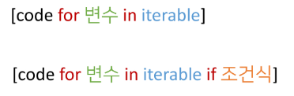
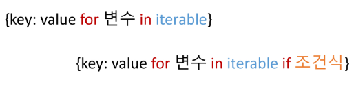
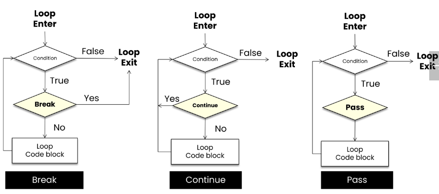

# 파이썬 기초

### 20230117

## 0. 코드스타일 가이드
- 코드를 '어떻게 작성할지'에 대한 가이드라인
- 파이썬에서 제안하는 스타일 가이드(강의에서 사용)
  - PEP8 ()
- 각 회사/프로젝트마다 따로 스타일 가이드를 설정하기도 함
  - Google Style guide 등

- 스타일 가이드 예시

### 들여쓰기
- Space Sensitive
- 문장을 구분할 때, 중괄호 대신 들여쓰기를 사용
- 들여쓰기를 할 때는 4칸 혹은 1탭을 입력
- **주의! 한 코드 안에서는 반드시 한 종류의 들여쓰기를 사용** → 혼용 금지
- Tab으로 들여쓰면 계속 탭으로 들여써야 함
- 원칙적으로는 공백 사용을 권장

## 1. 제어문

### 제어문(Control Statement)
- 순차, 선택, 반복
- 파이썬은 기본적으로 위에서부터 아래로 차례대로 명령을 수행
- **특정 상황**에 따라 코드를 선택적으로 실행(분기/조건) 하거나 계속하여 실행(반복)하는 제어가 필요함
- 제어문도 순서도(Flowchart)로 표현이 가능

## 2. 조건문

### 조건문 기본
- 조건문은 참/거짓을 판단할 수 있는 조건식과 함께 사용
  

- 조건에는 참/거짓에 대한 조건식
- 조건이 참인 경우 이후 들여쓰기 되어있는 코드블록을 실행
- 이외의 경우 else 이후 들여쓰기 되어있는 코드 블록을 실행
  - else는 선택적으로 활용할 수 있음
  

- 조건문 예시
  

~~~python
a = 5
if a > 5:
    print('5 초과')

else:
    print('5 이하')
print(a)
~~~

#### 조건문 실습 문제
- 조건문을 통해 변수 num의 값의 홀수/짝수 여부를 출력하시오.
  - 이때 num은 input을 통해 사용자로부터 입력을 받으시오.

~~~python
num = int(input('숫자 입력: '))
if num % 2: # == 0 등 의 값을 안넣어줘도, 0은 False의 값이 적용됨 / 반대로 0이 아닌 모든 값은 True로 적용.
    print('홀수입니다')
else:
    print('짝수입니다')
~~~

### 복수 조건문
- 복수의 조건식을 활용할 경우 elif(else if)를 활용하여 표현함.

- 복수조건문에서 if가 False라면 그 다음 elif로 넘어가는 구조 → ... 마지막 else까지 오는 구조.
- 중간에 True가 있다면 해당 조건문 실행한 후 빠져나감.

#### 복수조건문 실습 문제
- 미세먼지 농도에 따른 위험 등급이 다음과 같을 때, dust 값에 따라 등급을 출력하는 조건식을 작성하시오.(조건식 완료 후 미세먼지 확인 완료라는 문구 출력)
~~~python
dust = 80
if dust > 150:
    print('매우나쁨')
elif dust > 80:
    print('나쁨')
elif dust > 30:
    print('보통')
else:
    print('좋음')

print('미세먼지 확인 완료!')
~~~

### 중첩 조건문
- 조건문은 다른 조건문에 중첩되어 사용될 수 있음.
  - 들여쓰기에 유의하여 작성할 것.

#### 복수조건문 실습 문제
- 아래의 코드에서 중첩 조건문을 활용하여 미세먼지 농도가 300이 넘는 경우 '실외 활동을 자제하세요'를 추가로 출력하고 음수인 경우 '값이 잘못되었습니다'를 출력하시오.
~~~python
dust = 500
if dust > 150:
    print('매우나쁨')
    if dust > 300:
        print('실외 활동을 자제하세요.')
elif dust > 80:
    print('나쁨')
elif dust > 30:
    print('보통')
elif dust >= 0:
    print('좋음')
else:
    print('값이 잘못 되어있습니다.')
~~~

### 조건 표현식
- 조건 표현식(Conditional Expression)이란?
- 조건 표현식을 일반적으로 조건에 따라 값을 정할 때 활용
- 삼항 연산자로 부르기도 함.
- 조건문을 한줄로 쓰는 표현(간단한 조건문일때 한줄로 표현)
- True인 경우 값 if 조건 else False인 경우 값
ex) `value = num if num >= 0 else -num`
    - 절댓값을 저장하기 위한 코드

#### 조건 표현식 실습 문제
- 다음의 코드와 동일한 조건 표현식을 작성하시오.
  

~~~python
num = 2
result = '홀수입니다.' if num % 2 else '짝수입니다.'
print(result)
~~~

#### 조건 표현식 실습 문제2
- 다음의 코드와 동일한 조건문을 작성하시오.
  
## 3. 반복문

### 반복문 기본
- 특정 조건을 만족할 때까지 같은 동작을 계속 반복하고 싶을 때 사용

- while 문(특정한 조건을 알고 있을 때)
  - 종료 조건에 해당하는 코드를 통해 반복문을 종료시켜야 함.
- for 문(반복의 횟수를 알고 있을 때)
  - 반복 가능한 객체를 모두 순회하면 종료(별도의 종료 조건이 필요 없음)
- 반복 제어
  - break, continue, for-else

### while문
- while문은 조건식이 참인 경우 반복적으로 코드를 실행
  - 조건이 참인 경우 들여쓰기 되어 있는 코드 블록이 실행됨
  - 코드 블록이 모두 실행되고, 다시 조건식을 검사하며 반복적으로 실행됨.
  - while문은 무한 루프를 하지 않도록 종료 조건이 반드시 필요
  

### 복합 연산자(In-Place Operator)
- 복합 연산자는 연산과 할당을 합쳐 놓은 것 
  - 예시) 반복문을 통해서 개수를 카운트 하는 경우

### for문
- for문은 스퀸스(string,tuple,list,range)를 포함한 순회 가능한 객체의 요소를 모두 순회
  - 처음부터 끝까지 모두 순회하므로 별도의 종료 조건이 필요하지 않음
- Iterable
  - 순회 할 수 있는 자료형(string,tuple,list,dict,range,set 등)
  - 순회형 함수(range,enumerate)

### for문을 이용한 문자열(string) 순회
- 사용자가 입력한 문자를 한 글자씩 출력하시오

### 딕셔너리(Dictionary) 순회
- 딕셔너리는 기본적으로 key를 순회하며, key를 통해 값을 활용

### 추가 메서드를 활용한 딕셔너리(Dictionary) 순회
- 추가 메서드를 활용하여 순회할 수 있음.
  - keys() : Key로 구성된 결과
  - values() : value로 구성된 결과
  - item() : (Key,value)의 튜플로 구성된 결과

### 이터레이터(enumerate) 순회
- enumerate()
  - 인덱스와 객체를 쌍으로 담은 열거형(enumerate) 객체 반환
    - (index, value)형태의 tuple로 구성된 열거 객체를 반환
`print(list(enumerate(menbers, start=1)))`
기본값은 0, start를 지정하면 해당 값부터 순차적으로 증가

### List Comprehension
- 표현식과 제어문을 통해 특정한 값을 가진 리스트를 간결하게 생성하는 방법
  

#### List Comprehension 예시
- 1~3의 세제곱의 결과가 담긴 리스트를 만드시오.
~~~python
cubic_List = []
for number in range(1,4):
    cubic_List.append(number**3)
print(cubic_List)

=>

cubic_List = [number**3 for number in range(1,4)]
print(cubic_List)
~~~

### Dictionary Comprehension
- 표현식과 제어문을 통해 특정한 값을 가진 딕셔너리를 간결하게 생성하는 방법
  

#### Dictionary Comprehension 예시
- 1~3의 세제곱의 결과가 담긴 딕셔너리를 만드시오.
~~~python
cubic_dict = {}

for nuber in range(1,4):
    cubic_dict[number] = number ** 3
print(cubic_dict)

=>

cubic_dict = {nuber: number ** 3 for number in range(1,4)}
print(cubic_dict)
~~~

### 반복문 제어
- break
  - 반복문을 종료
- continue
  - continue 이후의 코드 블록은 수행하지 않고, 다음 반복을 수행
- for-else
  - 끝까지 반복문을 실행한 이후 else문 실행
    - break를 통해 중간에 종료되는 경우 else문은 실행되지 않음
- pass
  - 아무것도 하지 않음(문법적으로 필요하지만, 할 일이 없을 때 사용)

#### break
- break문을 만나면 반복문은 종료됨
~~~python
for i in range(10):
    if i > 1:
        print('0과 1만 필요해!')
        break
    print(i)

'''
0
1
0과 1만 필요해!
'''
~~~
**특정 조건에 반복문을 종료시키기 위해서는 break!**

#### continue
- continue 이후의 코드 블록은 수행하지 않고, 다음 반복을 수행
~~~python
for i in range(6):
    if i % 2 == 0:
        continue
    print(i)

'''
1
3
5
'''
~~~
**continue를 만나면, 이후 코드인 print(i)가 실행되지 않고 바로 다음 반복을 시행**

#### pass
- 아무것도 하지 않음
  - 특별히 할 일이 없을 때 자리를 채우는 용도로 사용
  - **반복문 아니여도 사용 가능**
~~~python
for i in range(4):
    if i == 2:
        pass
    print(i)

'''
0
1
2
3
'''
~~~

#### else
- 끝까지 반복문을 실행한 이후에 esle문 실행
~~~python
for chr in 'apple':
    if char == 'b':
        print('b!')
        break
else:
    print('b가 없습니다.')

**else 문은 break로 중단되었는지 여부에 따라 실행