# 파이썬 기초

### 20230117

## 0. 코드스타일 가이드
- 코드를 '어떻게 작성할지'에 대한 가이드라인
- 파이썬에서 제안하는 스타일 가이드(강의에서 사용)
  - PEP8 ()
- 각 회사/프로젝트마다 따로 스타일 가이드를 설정하기도 함
  - Google Style guide 등

### 들여쓰기
- Space Sensitive
- 문장을 구분할 때, 중괄호 대신 들여쓰기를 사용
- 들여쓰기를 할 때는 4칸 혹은 1탭을 입력
- **주의! 한 코드 안에서는 반드시 한 종류의 들여쓰기를 사용** → 혼용 금지
- Tab으로 들여쓰면 계속 탭으로 들여써야 함
- 원칙적으로는 공백 사용을 권장

## 1. 제어문

### 제어문(Control Statement)
- 순차, 선택, 반복
- 파이썬은 기본적으로 위에서부터 아래로 차례대로 명령을 수행
- **특정 상황**에 따라 코드를 선택적으로 실행(분기/조건) 하거나 계속하여 실행(반복)하는 제어가 필요함
- 제어문도 순서도(Flowchart)로 표현이 가능

## 2. 조건문

### 조건문 기본
- 조건문은 참/거짓을 판단할 수 있는 조건식과 함께 사용
  
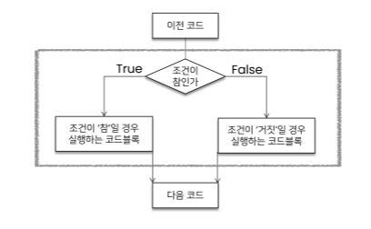

- 조건에는 참/거짓에 대한 조건식
- 조건이 참인 경우 이후 들여쓰기 되어있는 코드블록을 실행
- 이외의 경우 else 이후 들여쓰기 되어있는 코드 블록을 실행
  - else는 선택적으로 활용할 수 있음
  

- 조건문 예시
  

~~~python
a = 5
if a > 5:
    print('5 초과')

else:
    print('5 이하')
print(a)
~~~

#### 조건문 실습 문제
- 조건문을 통해 변수 num의 값의 홀수/짝수 여부를 출력하시오.
  - 이때 num은 input을 통해 사용자로부터 입력을 받으시오.

~~~python
num = int(input('숫자 입력: '))
if num % 2: # == 0 등 의 값을 안넣어줘도, 0은 False의 값이 적용됨 / 반대로 0이 아닌 모든 값은 True로 적용.
    print('홀수입니다')
else:
    print('짝수입니다')
~~~

### 복수 조건문
- 복수의 조건식을 활용할 경우 elif(else if)를 활용하여 표현함.

- 복수조건문에서 if가 False라면 그 다음 elif로 넘어가는 구조 → ... 마지막 else까지 오는 구조.
- 중간에 True가 있다면 해당 조건문 실행한 후 빠져나감.

#### 복수조건문 실습 문제
- 미세먼지 농도에 따른 위험 등급이 다음과 같을 때, dust 값에 따라 등급을 출력하는 조건식을 작성하시오.(조건식 완료 후 미세먼지 확인 완료라는 문구 출력)
~~~python
dust = 80
if dust > 150:
    print('매우나쁨')
elif dust > 80:
    print('나쁨')
elif dust > 30:
    print('보통')
else:
    print('좋음')

print('미세먼지 확인 완료!')
~~~

### 중첩 조건문
- 조건문은 다른 조건문에 중첩되어 사용될 수 있음.
  - 들여쓰기에 유의하여 작성할 것.

#### 복수조건문 실습 문제
- 아래의 코드에서 중첩 조건문을 활용하여 미세먼지 농도가 300이 넘는 경우 '실외 활동을 자제하세요'를 추가로 출력하고 음수인 경우 '값이 잘못되었습니다'를 출력하시오.
~~~python
dust = 500
if dust > 150:
    print('매우나쁨')
    if dust > 300:
        print('실외 활동을 자제하세요.')
elif dust > 80:
    print('나쁨')
elif dust > 30:
    print('보통')
elif dust >= 0:
    print('좋음')
else:
    print('값이 잘못 되어있습니다.')
~~~

### 조건 표현식
- 조건 표현식(Conditional Expression)이란?
- 조건 표현식을 일반적으로 조건에 따라 값을 정할 때 활용
- 삼항 연산자로 부르기도 함.
- 조건문을 한줄로 쓰는 표현(간단한 조건문일때 한줄로 표현)
- True인 경우 값 if 조건 else False인 경우 값
ex) `value = num if num >= 0 else -num`
    - 절댓값을 저장하기 위한 코드

#### 조건 표현식 실습 문제
- 다음의 코드와 동일한 조건 표현식을 작성하시오.
  

~~~python
num = 2
result = '홀수입니다.' if num % 2 else '짝수입니다.'
print(result)
~~~

## 3. 반복문

### 반복문 기본
- 특정 조건을 만족할 때까지 같은 동작을 계속 반복하고 싶을 때 사용
  

- while 문(특정한 조건을 알고 있을 때)
  - 종료 조건에 해당하는 코드를 통해 반복문을 종료시켜야 함.
- for 문(반복의 횟수를 알고 있을 때)
  - 반복 가능한 객체를 모두 순회하면 종료(별도의 종료 조건이 필요 없음)
- 반복 제어
  - break, continue, for-else

### while문
- while문은 조건식이 참인 경우 반복적으로 코드를 실행
  - 조건이 참인 경우 들여쓰기 되어 있는 코드 블록이 실행됨
  - 코드 블록이 모두 실행되고, 다시 조건식을 검사하며 반복적으로 실행됨.
  - while문은 무한 루프를 하지 않도록 종료 조건이 반드시 필요
  

### 복합 연산자(In-Place Operator)
- 복합 연산자는 연산과 할당을 합쳐 놓은 것 
  - 예시) 반복문을 통해서 개수를 카운트 하는 경우

### for문
- for문은 스퀸스(string,tuple,list,range)를 포함한 순회 가능한 객체의 요소를 모두 순회
  - 처음부터 끝까지 모두 순회하므로 별도의 종료 조건이 필요하지 않음
- Iterable
  - 순회 할 수 있는 자료형(string,tuple,list,dict,range,set 등)
  - 순회형 함수(range,enumerate)

### for문을 이용한 문자열(string) 순회
- 사용자가 입력한 문자를 한 글자씩 출력하시오

### 딕셔너리(Dictionary) 순회
- 딕셔너리는 기본적으로 key를 순회하며, key를 통해 값을 활용

### 추가 메서드를 활용한 딕셔너리(Dictionary) 순회
- 추가 메서드를 활용하여 순회할 수 있음.
  - keys() : Key로 구성된 결과
  - values() : value로 구성된 결과
  - item() : (Key,value)의 튜플로 구성된 결과

### 이터레이터(enumerate) 순회
- enumerate()
  - 인덱스와 객체를 쌍으로 담은 열거형(enumerate) 객체 반환
    - (index, value)형태의 tuple로 구성된 열거 객체를 반환
`print(list(enumerate(menbers, start=1)))`
기본값은 0, start를 지정하면 해당 값부터 순차적으로 증가

### List Comprehension
- 표현식과 제어문을 통해 특정한 값을 가진 리스트를 간결하게 생성하는 방법
  
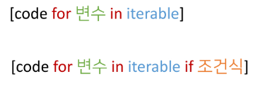

#### List Comprehension 예시
- 1~3의 세제곱의 결과가 담긴 리스트를 만드시오.
~~~python
cubic_List = []
for number in range(1,4):
    cubic_List.append(number**3)
print(cubic_List)

=>

cubic_List = [number**3 for number in range(1,4)]
print(cubic_List)
~~~

### Dictionary Comprehension
- 표현식과 제어문을 통해 특정한 값을 가진 딕셔너리를 간결하게 생성하는 방법
  
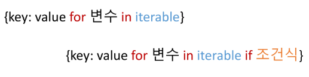

#### Dictionary Comprehension 예시
- 1~3의 세제곱의 결과가 담긴 딕셔너리를 만드시오.
~~~python
cubic_dict = {}

for nuber in range(1,4):
    cubic_dict[number] = number ** 3
print(cubic_dict)

=>

cubic_dict = {nuber: number ** 3 for number in range(1,4)}
print(cubic_dict)
~~~

### 반복문 제어
- break
  - 반복문을 종료
- continue
  - continue 이후의 코드 블록은 수행하지 않고, 다음 반복을 수행
- for-else
  - 끝까지 반복문을 실행한 이후 else문 실행
    - break를 통해 중간에 종료되는 경우 else문은 실행되지 않음
- pass
  - 아무것도 하지 않음(문법적으로 필요하지만, 할 일이 없을 때 사용)

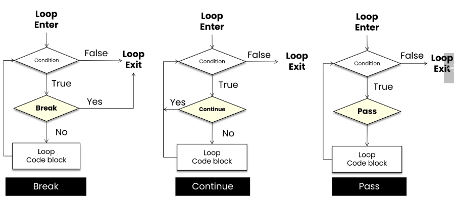

#### break
- break문을 만나면 반복문은 종료됨
~~~python
for i in range(10):
    if i > 1:
        print('0과 1만 필요해!')
        break
    print(i)

'''
0
1
0과 1만 필요해!
'''
~~~
**특정 조건에 반복문을 종료시키기 위해서는 break!**

#### continue
- continue 이후의 코드 블록은 수행하지 않고, 다음 반복을 수행
~~~python
for i in range(6):
    if i % 2 == 0:
        continue
    print(i)

'''
1
3
5
'''
~~~
**continue를 만나면, 이후 코드인 print(i)가 실행되지 않고 바로 다음 반복을 시행**

#### pass
- 아무것도 하지 않음
  - 특별히 할 일이 없을 때 자리를 채우는 용도로 사용
  - **반복문 아니여도 사용 가능**
~~~python
for i in range(4):
    if i == 2:
        pass
    print(i)

'''
0
1
2
3
'''
~~~

#### else
- 끝까지 반복문을 실행한 이후에 esle문 실행
~~~python
for chr in 'apple':
    if char == 'b':
        print('b!')
        break
else:
    print('b가 없습니다.')

**else 문은 break로 중단되었는지 여부에 따라 실행**
~~~

### 20230118

## 0. 들어가기전에...

### 함수
- 함수를 왜 사용할까요?
  - **Decomposition(분해)**
    - 기능을 분해
    - 재사용 가능하게 만듬
      - 간결하고 이해하기 쉽게 만듬!
  - **Abstraction(추상화)**
    - 복잡한 내용을 모르더라도 사용할 수 있도록(스마트폰)
    - 재사용성과 가독성, 생산성
    - 사실 내부 구조를 변경할게 아니라면 몰라도 무방
      - 그것이 함수의 장점이자 프로그래밍의 매력
      - 스마트폰의 원리를 잘 몰라도 우리는 잘 사용할 수 있음

## 1. 함수 기초

### 함수의 종류
- 함수는 크게 3 가지로 분류
  - 내장 함수 
    - 파이썬에 기본적으로 포함된 함수
  - 외장 함수
    - import 문을 통해 사용하며, 외부 라이브러리에서 제공하는 함수
  - 사용자 정의 함수
    - 직접 사용자가 만드는 함수

### 함수의 정의
- 함수(Function)
  - 특정한 기능을 하는 코드의 조각(묶음)
  - 특정 코드를 매번 다시 작성하지 않고, 필요시에만 호출하여 간편히 사용

### 함수 기본 구조
- 선언과 호출(define & call)
- 입력(Input)
- 문서화(Docstring)
- 범위(Scope)
- 결과값(Output)

### 선언과 호출(define & call)

- 함수의 선언은 **def 키워드** 를 활용함
- 들여쓰기를 통해 **Function body**(실행될 코드 블록)를 작성함
  - Docstring은 함수 body앞에 선택적으로 작성가능
  - 작성시에는 반드시 첫번째 문장에 문자열 ''''''
  - 함수는 parameter를 넘겨줄 수 있음
  - 함수는 동작 후에 return을 통해 결과값을 전달함
### 함수의 정의
- 함수를 사용하기 위해서는 먼저 함수를 **정의**해야 함

### 선언과 호출(define & call)
- 함수는 함수명()으로 호출하여 사용
  - parameter가 있는 경우, 함수명(값1,값2, …)으로 호출
- 함수는 호출해야만 작동함
- 함수는 호출되면 코드를 실행하고 return 값을 반환하고 종료

#### 함수 실행 순서 예시
- 이 코드의 실행 결과는 왜 9 일까요?
~~~Python
num1 = 0
num2 = 1

def func1(a,b):
    return a+b

def func2(a,b):
    return a-b

def func3(a,b):
    return func1(a,5) + func2(5,b)

res = func3(num1,num2)

print(res)
'''
9
'''
~~~

## 2. 함수의 결과값(Output)

### 값에 따른 함수의 종류
- Void function
  - 명시적인 return 값이 없는 경우, None을 반환하고 종료
- Value returning function
  - 함수 실행 후, return문을 통해 값 반환
  - return을 하게 되면, 값 반환 후 **함수가 바로 종료**

#### ***주의*** - print vs return
- print 함수와 return의 차이점
  - print를 사용하면 호출될 때마다 값이 출력됨(주로 테스트를 위해 사용)
  - 데이터 처리를 위해서는 return 사용

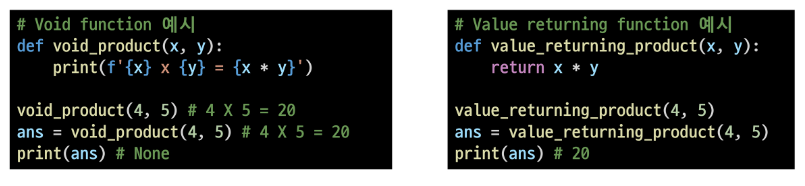

- REPL(Read-Eval-Print Loop)환경에서는 마지막으로 작성된 코드의 리턴 값을 보여주므로 같은 동작을 하는 것으로 착각 할 수 있음
  
### 두개 이상의 값 반환
- 아래 코드의 문제점은 무엇일까?
~~~python
def mandp(x,y):
    return x-y
    return x*y

y = mandp(4,5)
print(y) # -1
~~~
- **return은 항상 하나의 값 만을 반환**

두 개 이상의 값을 반환하는 방법은?
- 반환 값으로 튜플 사용
~~~python
def mandp(x,y):
    return x-y, x*y

y = mandp(4,5)
print(y) # (-1,20)
print(type(y)) # <class 'tuple>
~~~

### 함수 반환 정리
- return X → None
- return O → 하나를 반환
  → 여러개를 원한다면, Tuple 활용(혹은 list와 같은 컨테이너 사용)

## 3. 함수의 입력(Input)

### Parameter와 Argument
- Parameter : 함수를 정의할 때, 함수 내부에서 사용되는 변수
- Argument : 함수를 호출 할 때, 넣어주는 값

### Argument
- Argument란?
  - 함수 호출 시 함수의 prarameter를 통해 전달되는 값
  - Argument는 소괄호 안에 할당 `func_name(argument)`
    - 필수 Argument : 반드시 전달되어야 하는 argument
    - 선택 Argument : 값이 전달하지 않아도 되는 경우는 기본값이 전달

#### Positional Arguments
- 기본적으로 함수 호출 시 Argument는 위치에 따라 함수 내에 전달 됨

#### Keyword Arguments
- 직접 변수의 이름으로 특정 Argument를 전달할 수 있음
- Keyword Argument 다음에 Positional Argument를 활용할 수 없음

#### Default Arguments Values
- 기본값을 지정하여 함수 호출 시 argument 값을 설정하지 않도록 함
  - 정의된 것 보다 더 적은 개수의 argument 들로 호출될 수 있음
  

## 4. Python의 범위(Scope)

### Python의 범위(Scope)
- 함수는 코드 내부에 local scope를 생성하며, 그 외의 공간인 global scope로 구분

- scope
  - global scope : 코드 어디에서든 참조할 수 이쓴ㄴ 공간
  - local scope : 함수가 만든 scople. 함수 내부에서만 참조 가능
- variable
  - global variable : global scope에 정의된 변수
  - local variable : local scope에 정의된 변수

### 변수 수명주기(lifecycle)
- 변수는 각자의 생명주기(lifecycle)가 존재
  - built-in scope
    - 파이썬이 실행된 이후부터 영원히 유지
  - global scope
    - 모듈(~~.py)이 호출된 시점 이후 혹은 인터프리터가 끝날 때까지 유지
  - local scope
    - 함수가 호출될 때 생성되고, 함수가 종료될 때까지 유지
- 변수가 사라진다 : 더이상 접근을 할 수 없다.

ex)
~~~python
def func1():
  print('func1 시작')

  def func2():
    print('func2 시작')
    print('func2 끝')
    return

  func2()
  return

'''
# 함수를 실행하지 않음
'''
~~~
ex2)
~~~python
x='글로벌!' # global space에 속함
def func1():

  def func2():
    print(x)

  func2()

func1()

'''
글로벌!
'''
~~~

a는 Local scope에서만 존재

### 이름 검색 규칙(Name Resolution)
- 파이썬에서 사용되는 이름(식별자)들은 이름공간(namespace)에 저장되어 있음
cf) Namespace

(1) built-in : 이미들어있는 NS

(2) global : 파이썬 안에서 생성된 NS

(3) enclosed : 함수 중첩시 함수와 함수사이에 있는 NS

(4) local - 함수 안쪽에 생성되는 NS

- 아래와 같은 순서로 이름을 찾아나가며, **LEGB Rule**이라고 부름
  - Local scope : 지역 범위(현재 작업중인 범위)
  - Enclosed scope : 지역 범위 한 단계 위 범위
  - Global scope : 최상단에 위치한 범위
  - Built-in scope : 모든 것을 담고 있는 범위(정위하지 않고 사용할 수 있는 모든 것)
- **함수 내에서는 바깥 Scope의 변수에 접근 가능하나 수정 할 수 없음**
- **같은 이름으로 정의되면 LEGB순으로 찾아 할당한다.**
  
순서 : L -> E -> G -> B

### global 문
- 현재 코드 블록 전체에 적용되며, 나열된 식별자(이름)이 global variable임을 나타냄
  - global에 나열된 이름은 같은 코드 블록에서 global 앞에 등장 할 수 없음
  - global에 나열된 이름은 parameter, for 루프 대상, 클래스/함수 정의 등으로 정의되지 않아야 함.

#### global 예시

- `global x` - local 변수 값을  global 변수 값으로 바꿈
  
#### global 관련 에러

### nonlocal
- global을 제외하고 가장 가까운(둘러싸고 있는) scope의 변수를 연결하도록 함
  - nonlocal에 나열된 이름은 같은 코드 블록에서 nonlocal앞에 등장 할 수 없음
  - nonlocal에 나열된 이름은 parameter, for 루프 대상, 클래스/함수 정의 등으로 정의되지 않아야 함
- global과는 달리 이미 존재하는 이름과의 연결과 가능함

#### nonlobal 예시

#### nonlocal, global 비교

### 함수의 범위 주의
- 기본적으로 함수에서 선언된 변수는 local scope에 생성되며, 함수 종료 시 사라짐
- 해당 scope에 변수가 없는 경우 LEGB rule에 의해 이름을 검색함
  - 변수에 접근은 가능하지만, 해당 변수를 수정할 수 없음
  - 값을 할당하는 경우 해당 scope의 이름공간에 새롭게 생성되기 때문
  - 단, 함수 내에서 필요한 상위 scope 변수는 argument로 넘겨서 활용할 것

- 상위 scope에 있는 변수를 수정하고 싶다면, global, nonlocal 키워드를 활용 가능
  - 단, 코드가 복잡해지면서 변수의 변경을 추적하기 어렵고, 예기치 못한 오류가 발생
  - 가급적 사용하지 않는 것을 권장하며, 함수로 값을 바꾸고자 한다면 항상 argument로 넘기고 리턴 값을 사용 하는 것을 추천
  
### 20230119

## 1. 함수의 응용

### 내장함수(Built-in Functions)
- 파이썬 인터프리터에는 항상 사용할 수 있는 많은 함수와 형(type)이 내장되어 있음

### map
`map(function, iterable)`
- 순회 가능한 데이터구조(iterable)의 모든 요소에 함수(function)적용하고, 그 결과를 map object로 반환

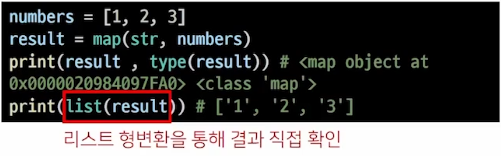

### map 활용 사례
- 알고리즘 문제 풀이시 input 값들을 숫자로 바로 활용하고 싶을 때 

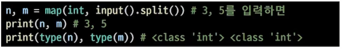

### filter
`filter(function,iterable)`
- 순회 가능한 데이터구조(iterable)의 모든 요소에 함수(function)적용하고, 그 결과가 True인 것들을 filter object로 반환

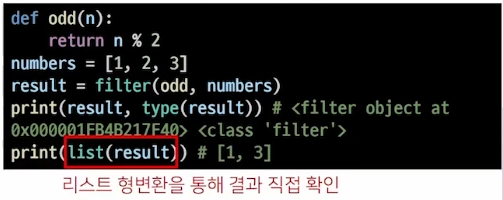

### zip
`zip(*iterables)`
- 복수의 iteable을 모아 튜플을 원소로 하는 zip object를 반환

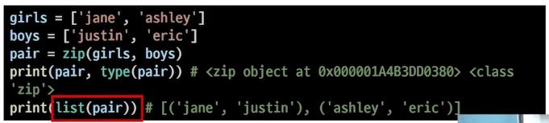

### lambda 함수
`lambda[parameter]:표현식`
- 람다 함수
  - 표현식을 계산한 결괏값을 반환하는 함수로, 이름이 없는 함수여서 익명 함수라고도 불림
- 특징
    - return문을 가질 수 없음
    간편 조건문 외 조건문이나 반복문을 가질 수 없음
- 장점
  - 함수를 정의해서 사용하는 것보다 간결하게 사용 가능
  - def를 사용할 수 없는 곳에서도 사용 가능

  cf) 함수에 소괄호, 뒤에 소괄호 하면 함수 실행됨
    - ex) `(lambda x:x*x)()`

### 재귀 함수(recursive function)
- 자기 자신을 호출하는 함수
- 무한한 호출을 목표로 하는 것이 아니며, 알고리즘 설계 및 구현에서 유용하게 활용
  - 알고리즘 중 재귀 함수로 로직을 표현하기 쉬운 경우가 있음(예-점화식)
  - 변수의 사용이 줄여들며, 코드의 가독성이 높아짐
- 1개 이상의 base case(종료되는 상황)가 존재하고, 수렴하도록 작성

#### 예시
- Factorial 

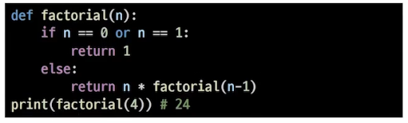

### 재귀 함수 주의 사항
- 재귀 함수는 base case에 도달할 때까지 함수를 호출함
- 메모리 스택이 넘치게 되면(stack overflow) 프로그램이 동작하지 않게 됨
- 파이썬에서는 최대 깊이(maximum recursion depth)가 1,000번으로, 호춧 횟수가 이를 넘어가게 되면 Recursion Error 발생

### 반복문과 재귀 함수 비교
- 알고리즘 자체가 재귀적인 표현이 자연스러운 경우 재귀함수를 사용함.
- 재귀 호출은 변수 사용을 줄여줄 수 있음.
- 재귀 호출은 입력 값이 커질 수록 연산 속도가 오래 걸림.

## 2. 패킹/언패킹(Packing/Unpacking)

### 패킹/언패킹 연산자(Operator) *
- 모든 시퀀스형(리스트, 튜플 등)은 패킹/언패킹 연산자 `*`를 이용하여 객채의 패킹 또는 언패킹이 가능

#### 패킹
- 대입문의 좌변 변소에 위치
- 우변의 객체 수가 좌변의 변수 수보다 많을 경우 객체를 순서대로 대입 
- 나머지 항목들은 모두 별 기호 표시된 변수에 리스트로 대입

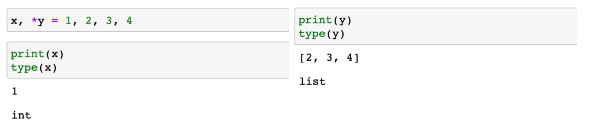

#### 언패킹
- argument 이름이 *로 시작하는 경우, argument unpacking이라 함.
  - *패킹의 경우, 리스트로 대입
  - *언패킹의 경우 튜플 형태로 대입

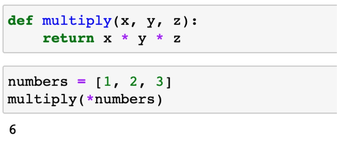

- 별표(*) 연산자가 곱셈을 의미하는지 패킹/언패킹 연산자인지 구분
  - 패킹/언패킹 연산자 *
    - *가 대입식의 좌측에 위치하는 경우
    - *가 단항 연산자로 사용되는 경우
      - 단항 연산자 : 하나의 항을 대상으로 연산이 이루어지는 연산자

  - 산술연산자로서의 *
    - *가 이항연산자로 사용되는 경우
      - 이항 연산자 : 두 개의 항을 대상으로 연산이 이루어지는 연산자

### 가변인자(*args)
- 가변인자란?
  - 여러 개의 Positional Argument를 하나의 필수 parameter로 받아서 사용
- 가변인자는 언제 사용하는가?
  - 몇 개의 Positional Argument를 받을지 모르는 함수를 정의할 때 사용

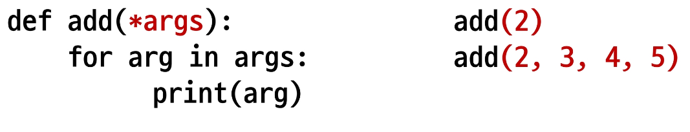

#### 패킹/언패킹
- 가변 인자를 이해하기 위해서는 패킹, 언패킹을 이해해야 함.
- 패킹
  - 여러 개의 데이터를 묶어서 변수에 할당하는 것
~~~python
numbers = (1,2,3,4,5) #패킹
print(numbers) #(1,2,3,4,5)
~~~
- 언패킹
  - 시퀀스 속의 요소들을 여러 개의 변수에 나누어 할당하는 것
~~~python
numbers = (1,2,3,4,5)
a,b,c,d,e = numbers #언패킹
print(a,b,c,d,e) # 1 2 3 4 5
~~~
- 언패킹시 변수의 개수와 할당하고자 하는 요소의 갯수가 동일해야 함
- 언패킹시 왼쪽의 변수에 asterisk(*)를 붙이면, 할당하고 남은 요소를 리스트에 담을 수 있음

### Asterrisk(*)와 가변 인자
- *는 스퀀스 언패킹 연산자로고도 불리며, 말 그대로 스퀀스를 풀어 헤치는 연산자
  - 주로 튜플이나 리스트를 언패킹하는데 사용
  - *를 활용하여 가변 인자를 만들 수 있음

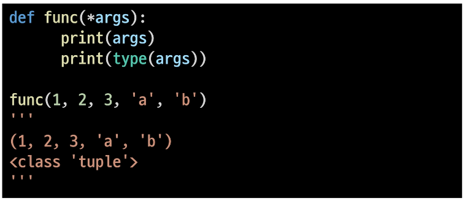

#### 가변인자 예시

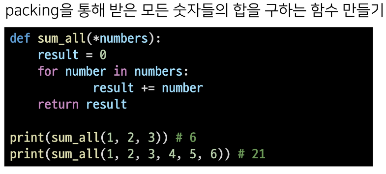

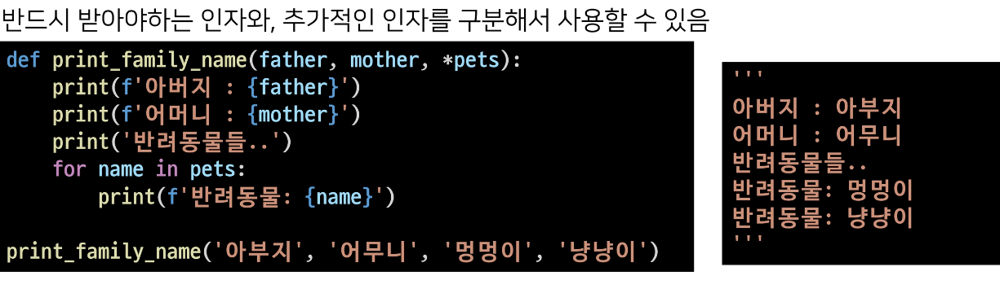

### 가변 키워드 인자(**kwargs)
- 몇 개의 키워드 인자를 받을지 모르는 함수를 정의할 때 유용
- **kwargs는 **딕셔너리로 묶여 처리**되며, parameter에 **를 붙여 표현

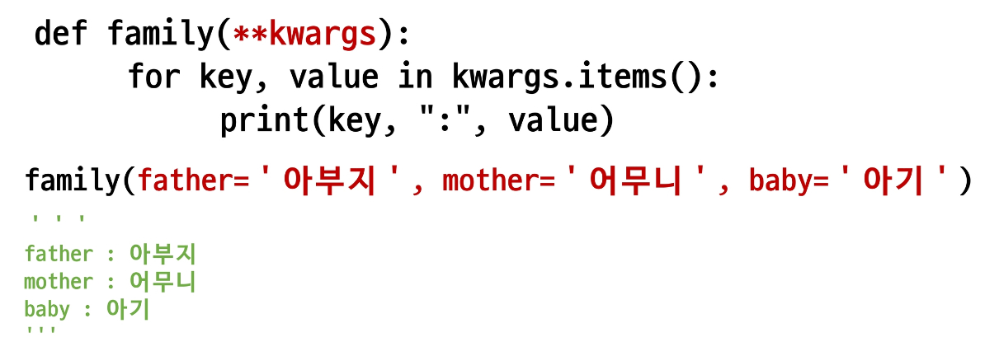

#### 가변 키워드 인자 예시 

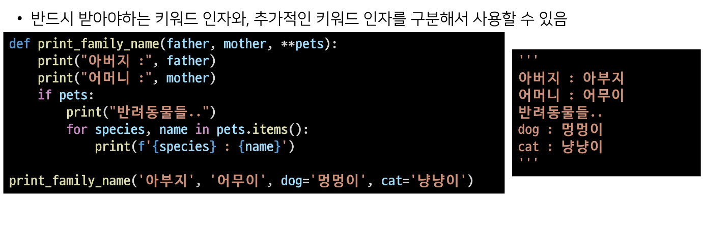

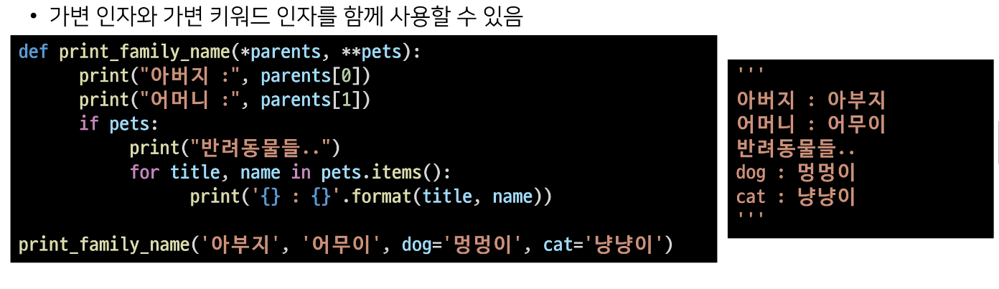

## 3. 모듈
- 다양한 기능을 하나의 파일로 (모듈, module)
- 다양한 파일을 하나의 폴더로(패키지, package)
- 다양한 패키지를 하나의 묶음으로(라이브러리, library)
- 이것을 관리하는 관리자(pip)
- 패키지의 활용 공간(가상환경)

### 모듈
  - 특정 기능을 하는 코드를 파이썬 파일(.py) 단위로 작성한 것
- 패키지
  - 특정 기능과 관련된 여러 모듈의 집합
  - 패키지 안에는 또 다른 서브 패키지를 포함

- 모듈과 패키지 불러오기
~~~python
import module
from module import var, function, Class
from module import *

from package import module
from package.module import var, function, Class
~~~

- 파이썬에 기본적으로 설치된 모듈과 내장 함수

#### 파이썬 패키지 관리자(pip)
- pPyPI(Python Package Index)에 저장된 외부 패키지들을 설치하도록 도와주는 패키지 관리 시스템
- 패키지 설치
  - 최신 버전 / 특정 버전 / 최소 버전을 명시하여 설치 할 수 있음
  - 이미 설치되어 있는 경우 이미 설치되어 있음을 알리고 아무것도 하지 않음

~~~bash
$ pip install SomePackage
$ pip install SomePackage ==1.0.5
$ pip install SomePackage>=1.0.4
~~~
- 패키지 삭제
~~~bash
$ pip uninstall SomePackage
~~~
- 패키지 목록 및 특정 패키지 정보
~~~bash
$ pip list
$ pip show SomePackage
~~~
- 패키지 관리하기
  - 아래의 명령어들을 통해 패키지 목록을 관리[1]하고 설치할 수 있음[2]
  - 일반적으로 패키지를 기록하는 파일의 이름은 requirements.txt로 정의함
  
~~~bash
$ pip freeze > requirements.txt
$ pip install -r requirements.txt
~~~

### 패키지
- 패키지는 여러 모듈 / 하위 패키지로 구조화
  - 활용 예시: package.module
- ahems vhfejdpsms __ init __.py 를 만들어 패키지로 인식
  -Python 3.3 부터는 파일이 없어도 되지만, 하위 버전 호환 및 프레임워크 등에서의 동작을 위해 파일을 생성하는 것을 권장

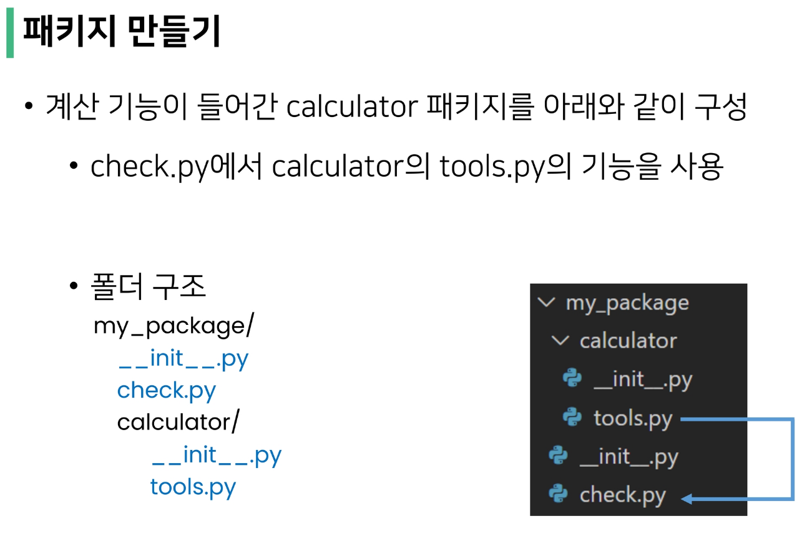

### 가상환경
- 파이썬 표준 라이브러리가 아닌 외부 패키지와 모듈을 사용하는 경우 모두 pip를 통해 설치 해야 함
- 복수의 프로젝트를 하는 경우 버전이 상이 할 수 있음
- 이러한 경우 가상환경을 만들어 프로젝트별로 독립적인 패키지를 관리 할 수 있음

- 가상환경을 만들고 관리하는데 사용되는 모듈
- 특정 디렉토리에 가상 환경을 만들고, 고유한 파이썬 패키지 집합을 가질 수 있음
  - 특정 폴더에 가상 환경이(패키지 집합 폴더 등) 있고
  - 실행 환경에서 가상환경을 활성화 시켜
  - 해당 폴더에 있는 패키지를 관리/사용함

#### 가상환경 생성
  - 가상환경을 생성하면, 해당 디렉토리에 별도의 파이썬 패키지가 설치됨
  $ python -m wenw <폴더명>

#### 가상환경 활성화/비활성화 

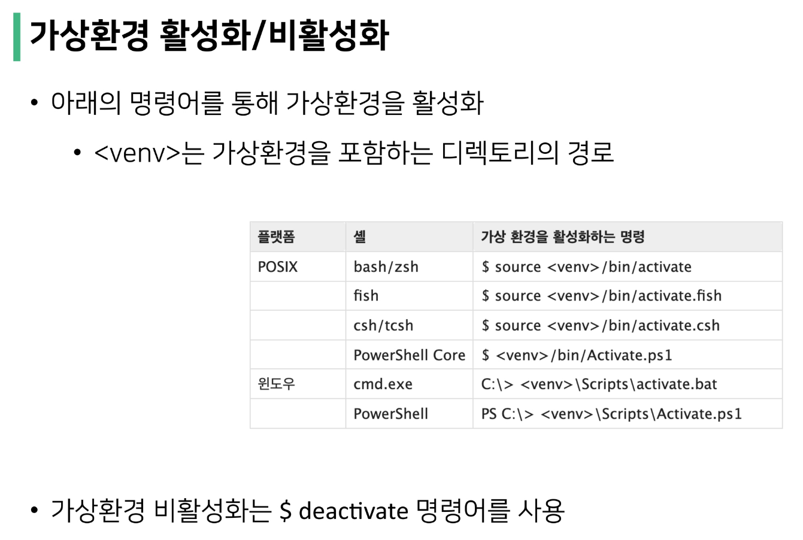

## 데이터구조

### 데이터 구조?
- 데이터 구조(Data Structure)
  - 여러 데이터를 효과적으로 사용, 관리하기 위한 구조
  - 파이썬에는 대표적으로 List,Tuple, Dict, Set 등의 데이터 구조가 있음
  - 타입과도 비슷함 "데이터 + 연산"
### 자료 구조
  - 컴퓨터 공학에서는 '자료구조'라고 함
  - 각 데이터의 효율적인 저장, 관리를 위한 구조를 나눠 놓은 것
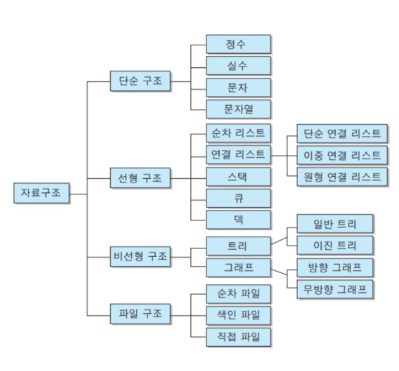

### 데이터 구조 활용하기
- 데이터 구조를 활용하기 위해서는 메서드(method)를 사용
  - 메서드는 클래스 내부에 정의한 함수, 사실상 함수 동일
  - 쉽게 설명하자면 객체의 기능(추후 객체 지향 프로그래밍에서 학습)
  

#### 데이터 구조 활용 예시
~~~python
List.append(10)
String.split()
etc...
~~~

### 파이썬 공식 문서의 표기법
- python 구문이 아니며, 문법을 표현하기 위한 것임
  
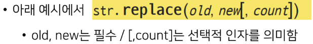

## 순서가 있는 데이터 구조

### 문자열(String)
- 문자열들의 나열(sequence of characters)
  - 모든 문자는 str 타입(변경 불가능한 immutable)
- 문자열은 작은 따옴표(')나 큰 따옴표(")를 활용하여 표기
  - 문자열을 묶을 때 동일한 문장부호 활용
  - PEP8에서는 소스코드 내에서 하나의 문장 부호를 선택하여 유지하도록 함
  - 
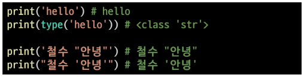

#### 문자열 조회/탐색 및 검증 메서드
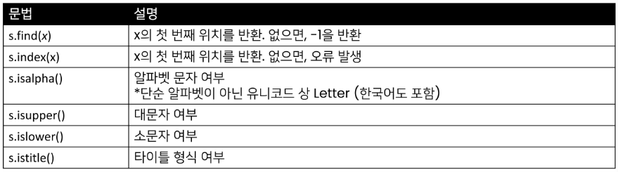

### 문자열 조회/탐색
- `.find(x)`
- x의 첫번째 위치를 반환. 없으면 -1을 반환함.(오류가 나지 않음)
~~~python
print('apple'.find('p')) # 1
print('apple'.find('k')) # -1
~~~
- `.index(x)`
- x의 첫번째 위치를 반환. 없으면 오류 발생.
~~~python
print('apple'.index('p')) # 1
print('apple'.index('k')) # ValueError : ~~~
~~~

#### 문자열 변경 메서드(S는 문자열)

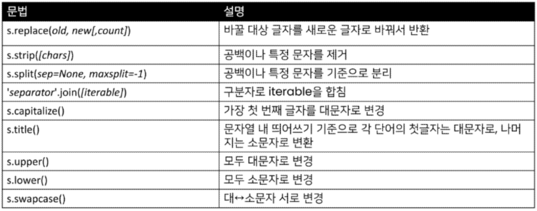

- 문자열은 불변형인데, 문자열 변경이 되는 이유?
    - -> 기존의 문자열을 변경하는 게 아니라, 변경된 문자열을 새롭게 만들어서 반환

- 문자열 변경
- `.replace(old,new[,count])`
- 바꿀 대상 글자를 새로운 글자로 바꿔서 반환
- count를 지정하면, 해당 개수만큼만 시행

- `.strip([chars])`
- 특정한 문자들을 지정하면,
  - 양쪽을 제거하거나(strip), 왼쪽을 제거하거나(lstrip), 오른쪽을 제거(rstrip)
- 문자열을 지정하지 않으면 공백을 제거함

- `.split(sep=None, maxsplit=-1)`
- 문자열을 특정한 단위로 나눠 리스트로 반환
  - sep이 None이거나 지정되지 않으면 연속된 공백문자를 단일한 공백문자로 간주하고, 선행/후행 공백은 빈 문자열에 포함시키지 않음.
  - maxsplit이 -1인 경우에는 제한이 없음.
  

### 리스트(List)
### 튜플(Tuple)

!Quiz

주어진 문자열에서 숫자, 문자, 기호가 각각 몇개인지 판단하는 함수를 작성해보세요
